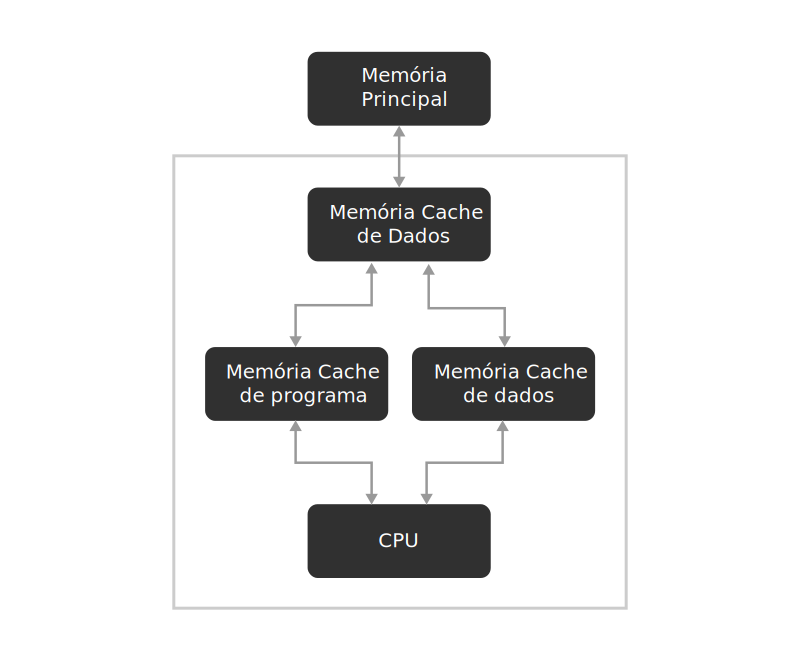

# Estrutura de computadores

## Máquinas Computacionais

* Máquina de calcular de pascal (pascalene)
* Cartão perfurado
* A máquina de Babbage
* Eletricidade - circuitos lógicos
* Computadores de Conrad Zuse (1938)
* Máquina de Turing
* Colossus - Primeiro computador completamente eletrônico
* **Primeira Geração** (1945-1959) - A era das válvulas
* Hravard Mark I
* ENIAC - Eletronic numerator, integrator, analyzer and computer
* **Segunda Geração** (1959-1964) - Os primeiros computadores transistorizados
* **Terceira geração** (1964-1977) - O surgimento do microchip
* **Quarta geração** (1977-1989) - Aumento da capacidade de integração de circuitos: VLSI (very large scale integration)
* **Quinta geração** (1990-Atual) - Computadores modernos: ULSI (ultra large scale integration)
* Lei de Moore

---

## Tipos de computadores

### Computadores descartáveis

* Utilizado em uma Tag para identificação por rádio frequência (RFID - *Radio frequency identification*), há dois tipos básicos:
  * RFIDs passivos => não tem bateria interna, apenas transmitem o código gravado em seu interior quando "consultados"
  * RFIDs ativos => possuem uma pequena bateria interna, são um pouco maiores e funcionam como um computador muito simples, capazes de fazer alguns pequenos cálculos
* Os *smart cards* usados em cartões de crédito/débito também se enquadram na categoria de computadores descartáveis

### Microcontroladores

* São computadores embarcados em equipamentos e podem gerenciar dispositivos, manipular uma interface com o usuário etc
* Muito presentes em eletrodomésticos entre diversos outros equipamentos
* São pequenos, mas são computadores completos, possuem CPU, memória e capacidade de E/S (realizada por botões, interruptores e portas específicas)

### Computadores dedicados para jogos

* São computadores convencionais, com vários recursos de hardware que são customizados para aumentar a sua performance na execução de jogos, tais como recursos gráficos e de som
* Possuem software limitado e pouca, ou nenhuma, capacidade de expansão

### Computadores pessoais

* Possuem uma configuração básica de alguns gigabytes de memória RAM e um disco rígido de que pode ter alguns terabytes de capacidade, um drive de CD-ROM/DVD/ROM/Blu-ray, uma interface de rede, wi-fi, bluetooth, monitor de alta resolução, som de alta definição com multicanais de saída, entre outros periféricos
* Possuem um sistema operacional (SO) complexo, uma extensa gama de opções para expansão e uma diversidade enorme de *softwares* disponíveis, de diferentes usos e fabricantes

### Servidores

* PCs normais, customizados com componentes mais poderosos
* Estações de trabalho (*workstation*) são muito utilizadas tanto como servidores de rede, como em rede de área local (LAN - *Local area network*), em geral utilizada dentro de uma empresa
* São configurados conforme a necessidade de um sistema

### Cluster

* Grupo de computadores interligados, que trabalham em conjunto para que, em muitos aspectos, possam ser vistos como um único sistema
* Todas as máquinas executam a mesma tarefa, sendo cada conjunto de nós controlado e configurado por software

### Mainframes

* São computadores de grande porte dedicados ao processamento de uma grande quantidade de informações, ocupando uma vasta área devido ao seu tamanho
* A maioria dos *Mainframes* não é mais rápida do que os servidores de grande desempenho atuais, no entanto, possuem uma grande capacidade de E/S e tem uma grande capacidade de armazenamento de dados
* São sistemas muito caros programados em COBOL e utilizados, principalmente, por bancos e grandes corporações

### Supercomputadores

* São máquinas extremamente elaboradas e de grande porte
* São utilizados em diversas áreas, principalmente para resolver problemas de cálculo de alta complexividade nas áreas cientificas
* Apesar de elevadíssimo desempenho, gradualmente eles estão sendo substituídos por sistemas COWs, pois esses podem oferecer desempenho semelhante, a um preço mais acessível

### Computadores notebook

* São essencialmente PCs, onde o seu hardware é customizado e "compactado", com bateria, em uma embalagem menor e portátil

### Tablets e smartphones

* Muito menores que notebooks, porém, de arquitetura semelhante
* A eletrônica é muito compacta, típica da tecnologia embarcada, além de o sistema funcionar com o uso quase exclusivo de bateria, geralmente de lítio-íon

### Comparação

|              Tipo              |                    Uso                     | preço US$ |
| :----------------------------: | :----------------------------------------: | :-------: |
|     Computador descartável     |         Tag utilizada em produtos          |    0,5    |
|        Microcontrolador        |    Relógios, carros, eletroeletrônicos     |    30     |
| Computador dedicado para jogos |                  Consoles                  |    500    |
|       Computador pessoal       |       Computador de mesa ou notebook       |    1,5    |
|            Servidor            |              Servidor de Rede              |   30000   |
|      Estação de trabalho       |        Máquinas de alto desempenho         |  >50000   |
|           Mainframe            | Processamento de dados e bloco em um banco | >5000000  |

---

## Sistemas operacionais

* Programa ou conjunto de programas que tem a função de gerenciar os recursos do sistema, além de propiciar a interface entre o usuário e o computador

* Possui um ***Kernel*** (núcleo), sua principal função é gerenciar todos os recursos do computador e, quando necessário, pode__carregar__ um programa de uma memória (ou HD) para outra memória (RAM, cache, registradores)
  * Permanece gravado na memória do sistema, sendo chamado de *software residente*
  * Programas que são carregados são chamados de *software não residente*
* O ***Basic Input/Output System*** (BIOS) é um *firmware*(software gravado em memória específica e apenas de leitura - ROM - *read only memory*) que, durante a inicialização do computador, é automaticamente carregado, inicializando alguns testes de componentes do *hardware*. Ele é responsável pelo reconhecimento de *hardware* do sistema e, posteriormente, pelo carregamento do SO(*Kernel*) do HD para a memória, processo esse denominado *booting* do sistema
* O SO tem 3 funções principais
  * Manter os recursos do computador (CPU, memória, HD)
  * estabelecer uma interface com o usuário
  * executar e oferecer recursos para programas que são carregados

### Sistemas operacionais para PCs

* É chamado de ***plataforma*** a combinação do *hardware* (do computador) e do SO

#### Microsoft Windows

* Iniciou como um ambiente operacional para MS-DOS, outra camada adicionada para separar o sistema operacional do usuário e, dessa forma, torná-lo mais fácil de usar. Essa camada é chamada de *Shell*, porque forma uma "cobertura", com ícones e menus, sobre o sistema operacional
* __A Partir do Windows 95, tornou-se independente, ou seja, não precisa que o DOS esteja instalado__
* Tem vários recursos que permitem uma boa interface gráfica para com o usuário, sendo possível graças aos ícones e menus que possibilitam que o usuário aponte e dê um clique onde ele deseja
* Também tem suporte *Plug and Play*, que permite que o SO identifique o periférico que foi conectado ao computador e se autoconfigure. Mas para funcionar, o *hardware* também deve suportar o padrão *Plug and Play*

#### Mac OS

* Foi o primeiro a oferecer uma interface gráfica aos usuários
* O ambiente de trabalho é projetado como um único sistema operacional de usuário e o caminho para arquivos e diretórios é quase completamente oculto
* A representação gráfica minimalista e a interface agradável e intuitiva dispensa o botão direito do mouse

#### UNIX

* Seu objetivo era criar um SO que permitisse a milhares de usuários acessarem simultaneamente um grande computador, no entanto, acabou falhando para esse propósito. Porém, sua salvação veio da idéia de criar um novo sistema de arquivos para o novo *Kernel* desenvolvido, criando uma estrutura hierárquica de diretórios na qual os arquivos podiam ser armazenador em forma ordenada
* Ele é independente da arquitetura do *hardware*, ou seja, ele pode ser instalado em diferentes tipos de máquinas. No entanto, a AT&T proibiu o estudo no meio acadêmico do UNIX, para proteger seu segredo comercial, assim, muitas universidades que usavam o código fonte do UNIX para ensinar sistemas operacionais foram proibidas de utilizá-lo e o ensino passou a ser teórico
* **Andrew Stuart Tanenbaum, professor da Universidade Vrije em Amsterdã e autor de vários livros na área de tecnologia da informação, criou uma versão simples do tipo UNIX (para fugir da proibição), porém, sem usar uma única linha de programação. Tanenbaum chamou esse sistema operacional de  *Minix***

#### Linux

* Sua história começou quando o estudante finlandês Linus Torvalds transformou o Minix em uma versão do UNIX para PCs
* Seu nome vem da fusão de Linus e UNIX, formando Linux
* Deixou o código aberto, ou seja, qualquer um pode estudá-lo e modificá-lo
* Atualmente é conhecido por ser um SO confiável, estável e versátil

#### Android

* É um SO para sistema móvel (*smartphone*, *tablets*) e também para TVs (Android TV), multimídias usados em carros (Android Auto) e relógios de pulso (Android wear), havendo uma interface específica para cada um desses dispositivos
* Seu desenvolvimento foi baseado no *Kernel* do Linux e, atualmente, é desenvolvido pela Google
* A interface do usuário é baseada no conceito de manipulação direta (utilizando telas sensíveis ao toque), usando gestos *multi-touch*

#### IOS

* Foi desenvolvido pela Apple para sistemas móveis
* Derivado do Mac OS
* Tal como Android, é baseado no conceito de manipulação direta, usando gestos *multi-touch*
* Diferente do Android, que é um SO aberto (como Linux), o IOS é proprietário, ou seja, seu código é fechado para os desenvolvedores

## Hardware I

### Processadores

* Atualmente, os processadores possuem, integrados a eles, "placas de vídeo", controladores de barramentos de expansão, memória Cache etc. Além disso, máquinas equipadas com placas de vídeo especiais são capazes de delegar ao processador da placa de video o execução de alguns programas que, anteriormente, eram executados apenas pelo Processador
* É um componente cuja função é executar os programas e que, adicionalmente, pode agregar funções especiais integradas
* É um arranjo de unidades:
  * 

#### CPU - *Central Unit Processing*

* É o elemento que realmente executa os programas no comutador
* 
  * **Unidade lógica de controle (UC)**
    * Responsável por controlar o acionamento de todas as outras unidades internas da CPU, de acordo com a instrução que está sendo executada
  * **Unidade lógica e aritmética (ULA)**
    * É responsável pela execução das operações aritméticas e lógicas booleanas para execução das instruções
    * Pode ser dividida em:
      * Unidade de números inteiros
      * Unidade de números em ponto flutuante
  * **Registradores**
    * São memórias internas ao processador, de pequena capacidade e alta velocidade
    * Utilizadas para armazenar resultados temporários ou controle de informações
    * O *Contador de Programa* (PC-*Program Counter*) indica o endereço da próxima instrução a ser buscada para posteriormente ser executada
    * O *Registrador de insrução* (IR-*Instructor Register*) mantém armazenada, temporariamente, a instrução que está sendo executada em um determinado momento
    * O *Acumulador* (ACC) armazena um dos valores que serão usados em uma operação lógica ou aritmética e, após ser executada, armazena seu resultado
    * O *Banco de Registradores* armazena, dentre outros, os registradores usados para empilhamento de valores
  * **Decodificador de instruções**
    * Analisa a instrução regatada da memória cache, descobrindo a operação que será executado e os valores que serão usados pela mesma e informa isso à UC
  * **Unidade de controle de acesso**
    * Gerencia a troca de valores com a memória cache
* Cada arquitetura de processador refere-se ao projeto do processador. Possui suas peculiaridades, assim, quando comparamos a organização interna de diferentes processadores, podemos notar a presença de elementos específicos
  * **Máquina de Von Neumann**
    * 
    * Essa máquina opera segundo o ciclo de instrução ou de busca, decodificação e execução, o qual consiste em:
      1. Trazer a próxima instrução da memória e armazená-la no Registrador de instruções
      2. Alterar o contador de programa para que aponte para a próxima instrução
      3. Determinar o tipo de instrução armazenada no IR
      4. Se a instrução usar uma palavra na memória, determinar onde essa palavra está
      5. Trazer a palavra para dentro de um registrador da CPU, se necessário
      6. Executar a instrução
      7. Voltar à etapa 1 para iniciar a execução da instrução seguinte
    * >Tal sequência de Etapas costuma ser denominada ciclo buscar-decodificar-executar. É fundamental para a operação de todos os computadores - Tanenbaum; Austin, 2016
  * **Clock** (Relógio)
    * É um sinal elétrico que oscila entre dois valores de tensão ditos alto e baixo, é gerado por um circuito oscilador ou PLL
    * Tem as funções de sincronizar e determinar a velocidade de execução das instruções (através da Unidade de Controle, dentro da CPU) e também de determinar a velocidade de transferência de dados no computador, por exemplo, entre o processador e a memória principal
    * A oscilação do sinal elétrico de *clock* é medida em ciclos por segundo, ou seja, Hertz(Hz)
    * Os computadores atuais trabalham com frequência  da ordem de vários GigaHz(1 Giga = 1.000.000.000)
    * Especificar um processador envolve muito mais do que escolher o clock da máquina, envolve escolher a família (i7, i5, i3), a arquitetura (Coffe Lake, or Kaby Lake), a memória (cache). Todas estas escolhas dependem do tipo de programa que será, predominantemente, executado pela máquina
  * **Arquitetura de processadores**
    * Tipos
      * **RISC**
        * Computador com um conjunto reduzido de instruções (RISC - *Reduced Instruction Set Computer): é uma arquitetura de computador com um conjunto simples e pequeno de instruções, cada conjunto leva praticamente o mesmo tempo para ser executado
        * A maioria das CPUs utilizadas em desktops e notebooks é da família x86, que são na sua maioria CISC e apenas algumas são RISC. Algumas CPUs mais modernas possuam tecnologia para traduzir instruções de x86 baseadas em arquitetura CISC, em instruções baseadas em arquitetura RISc, que são mais simples
        * CPUs baseadas na tecnologia RISC não possuem microprogramação, ou seja, as instruções são executadas diretamente pelo hardware
        * Características
          * Número de instruções reduzido
          * Codificação de instruções em uma palavra de tamanho fixo
          * Execução sem microcódigo
          * Altas taxas de execução (1 instrução por ciclo)
          * Poucos modos de endereçamento
          * Operações envolvendo a memória principal restritas a transferências
          * Operações lógicas e aritméticas entre registradores, com instruções de três endereços
      * **CISC**
        * Computador com um Conjunto complexo de Instruções(CISC-*Complex Instruxtion Set Computer): é um processador capaz de executar centenas de diferentes instruções complexas, sendo mais versáteis que as CPUs com tecnologia RISC
        * CPUs baseadas na tecnologia CISC comtêm um conjunto de códigos de instruções que são gravados no processador, chamado micro programação, que permite receber as instruções dos programas e executá-las. Essas CPUs tem, internamente, núcleos RISC, sendo assim, a parte CISC do processador cuida das instruções mais complexas, enquanto o núcleo RISC cuida das mais simples e, por isso, estas CPUs são chamadas de híbridas
      * **Processadores com dois ou mais núcleos (cores)**
        * CPUs dessa natureza possuem dois ou mais núcleos distintos no mesmo circuito integrado, assim, ela pode trabalhar com dois processos ao mesmo tempo, um processo para cada núcleo, melhorando o desempenho da CPU como um todo
        * Ter processadores com muitos núcleos não quer dizer, necessariamente, que as máquinas serão muito mais rápidas, pois outros fatores influenciam nesse quesito, tais como as velocidades das memórias, dispositivos de entrada e saída e a forma como os programas executados são desenvolvidos
        * Uma alternativa aos núcleos reais é a tecnologia *Hyper-Threading*, que simula, em um único processador físico ou núcleo real, dois processadores lógicos. Cada processador lógico recebe seu próprio controlador de interrupção programável e conjunto de registradores. Os outros recursos do processador físico, tais como cache de memória, unidade de execução, unidade lógica e aritmética, unidade de ponto flutuante e barramentos, são compartilhados entre os processadores lógicos. Esse recurso também tem seu desempenho influenciado pelos mesmos parâmetros considerados no parágrafo anterior

---
