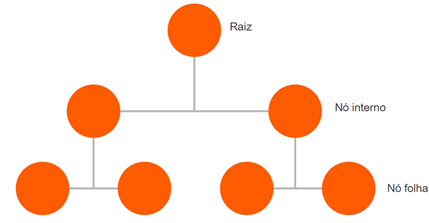

# Inteligência Artificial e Computacional
## Introdução à inteligência artificial
* ==Computação Natural (CN) - 1960==
	* Formalizada em 2004 por Leandro N. de Castro e Fernando J. Van Zuben
	* Permeia três formas de implementação
		* *Computação em que ideias são obtidas através da observação da natureza, que é a inspiração para o desenvolvimento de soluções de problemas complexos*
			* Exemplos
				* Redes neurais artificiais (1943)
				* Computação evolutiva (1965)
				* Inteligência de enxame (1988)
				* Sistemas imunológicos artificiais (1999)
				* Entre outros ...
		* *Síntese de fenômenos naturais através da computação que envolve mecanismos de computação para sintetizar comportamentos naturais, padrões e processos biológicos*
			* As principais linhas de atuação são os estudos sobre a vida de organismos artificiais
				* Vida artificial (1998)
				* Geometria fractal (1982)
		* *Computação com mecanismos naturais que são novos paradigmas de computação e podem resultar em computadores altamente potentes, chamados computadores naturais*
			* Baseados em computação molecular, através de cadeias de DNA (1998)
			* Computação quântica (2000)
			* Entre outros
* ==Inteligência Computacional (IC) - 1994 & Aprendizagem de Máquina - 2007==
	* Surgiu como uma forma de desassociar o que a IA clássica pretendia
	* Algoritmos de Redes Neurais Artificiais (RNA), Computação Evolutiva (algoritmos genéticos) e Lógica de Fuzzy fizeram parte das técnicas de implementação do IC
	* O Machine Learning, atualmente muito associado ao Big Data e ao Analytics, foi defendido por T. Mitchell em 1997 e surgiu dos sistemas baseados em conhecimento da IA clássica
	* O grande desafio é desenvolver sistemas capazes de aprender
		* Por si mesmos, através de experiências e comportamentos passados (aprendizagem não supervisionada)
		* Por meio de entrada de mapas de dados (aprendizagem supervisionada)
		* Interagindo com o ambiente (aprendizagem por reforço), p.e. dirigindo um carro
	* Para a implementação do Machine Learning, diversas técnicas estão envolvidas, do uso de estatística para auxiliar na análise e predição de dados a técnicas de mineração de dados (Data Mining), algoritmos de árvore de decisão, redes Bayesianas e processos de clustering
	* O Deep Learning é uma técnica de Machine Learning eficaz e precisa para a Aprendizagem de Máquina que utiliza grandes quantidades de dados não estruturados e possibilita uma representação hierárquica das camadas de dados
	* Algoritmos de RNA são utilizados no Deep Learning justamente por permitir que o aprendizado de padrões ocorra. Quaisquer soluções que envolvam reconhecimento de voz, processamento de imagem, análise de comportamento, entre outras características, são aplicações factíveis de Deep Learning

* **Aplicabilidade**
	* O mais interessante do posicionamento da IA é ser altamente aplicável nas soluções de negócios
	* Instituições financeiras e de cobrança têm utilizado algoritmos de detecção de fraude que analisam padrões no processamento dos dados trafegados, buscando validar, encontrar erros de informações e minerá-los em grupos segmentados. O que permite que os sistemas sejam capazes de prever "candidatos" a fraudes, tendo por base situações anteriormente detectadas e mapeadas, ou ainda simular fraudes que jamais ocorreram, mas que tenham possibilidade de serem aplicadas
	* Técnicas de análise forense, arquiteturas de redes Bayesianas e algoritmos de classificação são muito utilizados na predição dos dados para detecção. Grandes montadoras têm apostado em veículos autônomos. Por meio de algoritmos de Deep Learning, é possível aperfeiçoar o reconhecimento de imagens, aumentando a segurança, além de permitir o aprendizado com a experiência realizada
	* Grandes centros médicos no mundo estão cada vez mais recheados de equipamentos e sistemas inteligentes para leituras de imagens médicas. A técnica de processamento de imagens utiliza métodos de IA, tais como Redes Neurais Artificiais e Lógica Fuzzy. O Google desenvolveu a API Google Vision, baseada em Aprendizagem de Máquina e reconhecimento de padrões, sendo possível, de maneira muito simples, implementar a leitura de imagens e a exportação em texto do conteúdo da imagem
	* Os cada vez mais atuantes chatbots como atendimento inteligente e automatizado são um grande canal de agilidade no atendimento sem a perda na qualidade da informação. O Poupatempo, projeto do Estado de São Paulo que oferece diversos serviços de emissão de documentos, atestados, licenciamento veicular, entre outros, implantou o Poupinha, um atendente virtual (Chatbot). Através do próprio Portal do Poupatempo ou da página do Facebook, ele tira dúvidas do usuário sobre informações das condições, prazos, valores e retirada de documentos, atendendo, em média, 5 mil usuários ao dia
	* A implementação da mineração de sentimentos e de opiniões tem sido outra grande aposta da utilização de IA. As redes sociais e as interações digitais, via os diversos dispositivos móveis, têm produzido uma grande quantidade de informações descontroladas e desorganizadas, afastando a personificação do ser humano perante a sociedade, produtos e serviços. Uma reaproximação se faz necessária para um entendimento mais real dos significados intrínsecos dos posts, imagens, vídeos, conversas e likes. Classificar o grau de sentimento que o usuário dá às interações e suas opiniões implícitas ou explícitas é artefato sendo trabalhado pela é artefato sendo trabalhado pela IA em prol da personificação
## Resolução de problemas por meio de busca
### Problemas e Soluções
* Há diversas maneiras de se resolver um problema, assim como há diversos tipos de problemas. Geralmente os problemas podem ser solucionados com um conjunto de ações que levam a um objetivo. Quando as possibilidades para solução de um problema tornam-se quase inumeráveis, o espaço para se explorar uma solução deve ser considerado com técnicas que guiem a resolução do problema, levando em conta **limitações de tempo**, **processamento** e **memória**
* Definição formal de um problema:
	* **Um problema é definido em cinco componentes** (considerando um agente que realiza entregas de produtos adquiridos pela internet partindo de um centro de distribuição (CD) até chegar ao local de entrega (LE), percorrendo o caminho (C) mais barato possível, de acordo com uma função de custo (FC)
		* Um **estado inicial** ($S_0$) a partir do qual o agente inicia. O agente inicia no CD, que é o $S_0$
		* Uma descrição das **ações** ($a_n$) possíveis ao agente. Dado um estado $S$, *ações* consistem, por exemplo, nas vias que partem do CD
		* Um **modelo de transição** entre as ações, que defino o próximo estado $S_y$, dada a escolha de uma ação, estando no estado $S_x$. É formalizado como $RESULTADO(S_x,a)=S_y$. Esses três componentes, estado inicial, ações e o modelo de transição compõem o espaço de estados do problema. O **espaço de estados** pode ser representado como um **grafo** dirigido, em que os nós são os estados e as arestas são as ações. Nesse grafo, um **caminho** é uma sequência de estados conectados por ações (arestas)
		* Um teste de **objetivo**, que verifica, a cada estado, se o estado é o objetivo. Para alguns problemas, pode-se ter mais de um estado objetivo, que define a solução do problema. No exemplo dado, o **estado objetivo** é o local de entrega (LE) da mercadoria adquirida
		* Uma **função de custo do caminho**, que atribui um valor numérico a cada caminho do grafo. Na função de custo do agente entregador a quilometragem, por simplicidade, pode ser considerada como função de custo do caminho, quanto menor o caminho, menor o custo
	* No exemplo do agente entregador, além de considerar o caminho mais curto, a modelagem real deve levar em consideração outras variáveis, tais como:
		* Tempo da viagem
		* Horário de trabalho do entregador, que deve se adequar à legislação trabalhista vigente
		* Velocidade das vias
		* Condições reais do trânsito nas vias
		* Número de cruzamentos
		* Dentre muitas outras variáveis
### Métodos de Busca por solução

* Cada possível solução de um problema forma o que chamamos de **árvore de busca**. Uma árvore consiste em uma estrutura de dados não linear composta por *nós* (informações) organizadas hierarquicamente
* Critérios de avaliação da busca
  * Completeza
    * Capacidade do algoritmo pesquisar a arvore toda caso necessário
  * Otimalidade
    * Capacidade de encontrar a melhor solução
  * Complexidade de tempo
    * Tempo médio para se encontrar a solução
  * Complexidade de espaço
    * Espaço contido na árvore que será processado pelo algoritmo

### Busca sem informação
* A busca sem informação, ou busca cega, é realizada sem informação adicional sobre os estados, além da definição do problema. A estratégia é gerar novos estados e verificar se um estado objetivo é alcnçado ou não. Difere na ordem em que os estados são explorados: *busca em largura* ou *em profundidade*
* Busca em largura
  * A busca em largura (BFS - *Breadth-First Search*) é uma estratégia em que o nó raiz é verificado antes dos nós filhos do nó raiz. Essa estratégia é utilizada recursivamente para os nós internos da árvore (subárvores)
* Busca em profundidade
  * Na busca em profundidade (DFS - *Depth-First Search*) busca-se o nó mais profundo a partir da raiz

### Busca informada