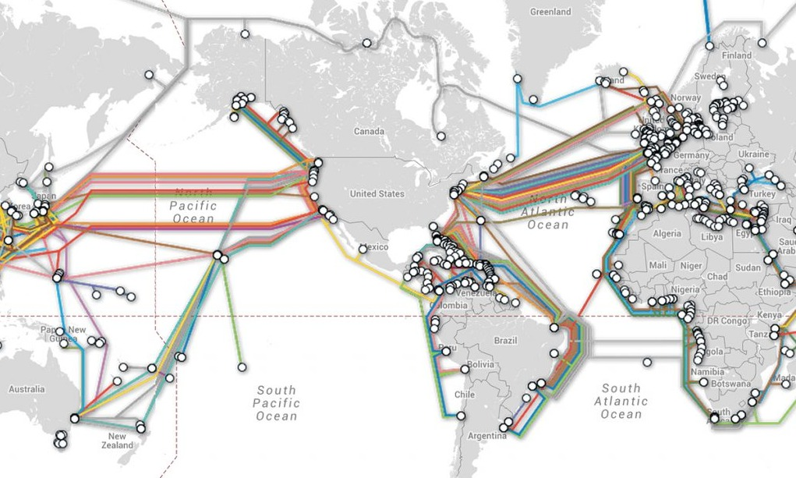
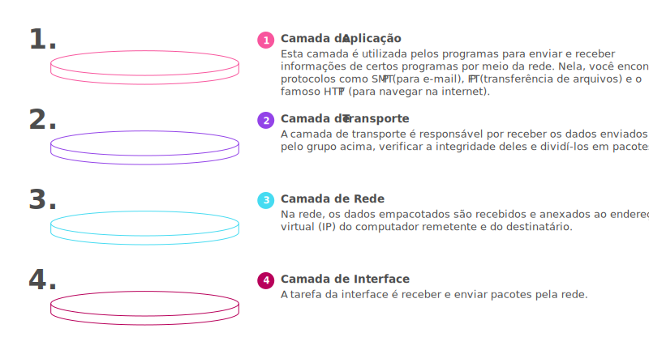
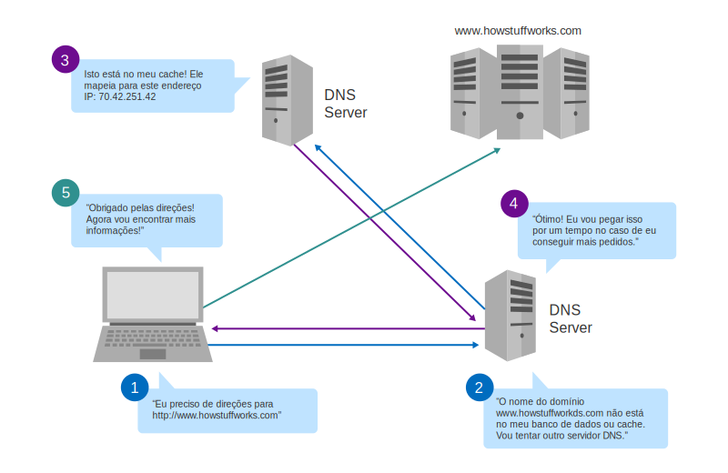

# Responsive Web Development
------

## Introdução ao Desenvolvimento Web
---

### História da internet
Podemos definir a internet como um conjunto de redes de computadores interligadas pelo mundo, que utilizam um conjunto de protocolos e serviços em comum para emitir uma comunicação plena.

A internet surgiu na Guerra Fria na década de 1960. A disputa pela hegemonia política, econômica e militar era liderada pelas duas potências mundiais da época: União Soviética e Estador Unidos. Esses dois países precisavam de tecnologia, inovação ou ferramentas para vencer a disputa.

Os Estados Unidos desenvolveram a rede mundial de computadores com objetivos militares. O objetivo foi descentralizar as informações dos EUA, as informações não seriam perdidas e a comunicação entre os centros de informações seriam mantidas. Dessa forma, a *Agência de Projetos de Pesquisas Avançadas* (ARPA) desenvolveu uma rede de comunicações chamada **ARPANET**.

Nas décadas de 1970 e 1980, essa rede mundial de computadores foi utilizada também para comunicação no meio acadêmico, entre universidades e descobertas através da rede. Mas foi na década de 1990 que a internet foi disponibilizada para a população em geral. Nesse ano, o físico britânico Timothy John Berners-Lee desenvolveu a World Wide Web (www) que possibilita a utilização de interface gráfica e a criação de sites com a linguagem HTML e a sua transferência com o protocolo HTTP, permitindo navegar de um site a outro, ou de uma página a outra. Assim nasceu a internet que conhecemos hoje.

#### Servidores
Para que os sites e aplicações fiquem disponíveis na internet, eles devem estar hospedados (implantados) em servidores. Servidores são computadores de alta capacidade de processamento e armazenamento que rodam softwares específicos e estão conectados à internet. Dessa forma, os sites e as aplicações web ficam disponíveis a qualquer dispositivo conectado à rede mundial de computadores (internet). É possível também implantar um sistema web em uma rede privada, para restringir o acesso dos usuários. Essa rede é denominada **Intranet**.

Para acessar um site, é necessário utilizar um programa chamado **Navegador** ou **Browser** e digitar a URL do site. Assim, será emviada uma mensagem até o servidor em que o site está implantado e, por sua vez, este deve processar a mensagem e enviar de volta as informações da página para o usuário. Com essas informações, o browser é capaz de exibir o site.

O acesso as informações a informações que estão distantes se dá através dos **Backbones**, as auto estradas da internet. Um backbone é um conjunto de poderosos computadores conectados por linhas de grande largura de banda, como canais de fibras ópticas, elos de satélites e elos de transmissão por rádio. Para construir a internet, vários backbones estão interligados e encontram-se hierarquicamente divididos: os de ligações intercontinentais, que derivam de backbones internacionais, que por sua vez derivam de backbones nacionais. Dessa forma, podemos dizer que os backbones sao a espinha dorsal da internet, pois praticamente todas as informações que trafegam por ela passam por backbones.

A requisição passa pela rede interna até alcançar o seu provedor de internet, que finalmente chega a um backbone. O backbone do Brasil se conecta a outros backbones do mundo, então o seu pedido chega até o servidor onde a página está hospedada. Assim a resposta é retornada através de um caminho inverso, não sendo necessariamente o mesmo caminho da ida
Os backbones de diferentes continentes estão conectados através de cabos submarinos, que atravessam mares e oceanos para interligar todo o mundo. Esses cabos de fibra óptica são capazes de transmitir milhares de informações por segundo, permitindo assim uma troca de informação rápida e eficiente

#### TCP/IP
A comunicação entre as redes espalhadas por todo o mundo é possível através do uso do conjunto de protocolos conhecido como *TCP/IP Protocol Suite*. TCP é o Protocolo de Controle de Transmissão e o IP é o Protocolo de Internet. Essa arquitetura surgiu em 1975 na rede Arpanet

É formada por quatro camadas, e cada camada possui as suas responsabilidades bem definidas, fornecendo serviços para as camadas superiores:
* Camada de Aplicação
* Camada de Transporte
* Camada de Rede
* Camada de Interface

Em uma rede TCP/IP cada equipamento conectado à rede deve possuir um endereço único, capaz de identificá-lo. Esses endereços, chamados de endereços IP, permitem a entrega das informações aos seus destinos de forma correta e eficiente (Exemplo de um endereço IP: 128.32.99.5)

#### Domínios
Quando um usuário acessa um site através do browser, normalmente ele digita um endereço diferente do de IP. Para facilitar a memorização dos endereços de equipamentos conectados à internet utilizamos os nomes de domínios, que permite a tradução para um endereço IP

A associação de nomes de domínio para um endereço IP é feita por um conjunto de servidores de DNS - Domain Name Services ou Sistema de Nomes de Domínio. O DNS está estruturado em dois pontos básicos:
* Organização da Internet em Domínios
* Distribuição dos Servidores DNS na Internet

A organização da internet em domínio tem como objetivo evitar a reutilização de um mesmo nome por mais de um equipamento conectado à internet e descentralizar o cadastramento dos mesmos. Assim, cada país possui uma entidade responsável por atribuir endereços de IP e fazer a sua associação com um nome

#### Serviços disponíveis na internet
Existem diversos serviços disponíveis na internet. O ponto em comum entre os serviços disponíveis é o modelo de implementação: cliente-servidor. Nesse modelo, os serviços são disponibilizados em programas-servidores, e o usuário acessa esses programas através da internet utilizando programas-clientes. Os principais serviços disponíveis atualmente na internet são:
* World Wide Web
* FTP
* E-mail

##### World Wide Web (www)
Serviço de acesso a informações por hipertexto. A busca e obtenção de informações utiliza um mecanismo de navegação conhecido por hipertexto, que cria a imagem de uma teia que interliga documentos pela internet. vem daí o nome, que traduzido fica *teia de alcance mundial*

Esses documentos ...

##### FTP - Sistema de transferência de arquivos

##### E-mail - Serviços de correio eletrônico

#### W3C e Web Standards