# Responsive Web Development
------

## Introdução ao Desenvolvimento Web
---

### História da internet
Podemos definir a internet como um conjunto de redes de computadores interligadas pelo mundo, que utilizam um conjunto de protocolos e serviços em comum para emitir uma comunicação plena.

A internet surgiu na Guerra Fria na década de 1960. A disputa pela hegemonia política, econômica e militar era liderada pelas duas potências mundiais da época: União Soviética e Estador Unidos. Esses dois países precisavam de tecnologia, inovação ou ferramentas para vencer a disputa.

Os Estados Unidos desenvolveram a rede mundial de computadores com objetivos militares. O objetivo foi descentralizar as informações dos EUA, as informações não seriam perdidas e a comunicação entre os centros de informações seriam mantidas. Dessa forma, a *Agência de Projetos de Pesquisas Avançadas* (ARPA) desenvolveu uma rede de comunicações chamada **ARPANET**.

Nas décadas de 1970 e 1980, essa rede mundial de computadores foi utilizada também para comunicação no meio acadêmico, entre universidades e descobertas através da rede. Mas foi na década de 1990 que a internet foi disponibilizada para a população em geral. Nesse ano, o físico britânico Timothy John Berners-Lee desenvolveu a World Wide Web (www) que possibilita a utilização de interface gráfica e a criação de sites com a linguagem HTML e a sua transferência com o protocolo HTTP, permitindo navegar de um site a outro, ou de uma página a outra. Assim nasceu a internet que conhecemos hoje.

#### Servidores
Para que os sites e aplicações fiquem disponíveis na internet, eles devem estar hospedados (implantados) em servidores. Servidores são computadores de alta capacidade de processamento e armazenamento que rodam softwares específicos e estão conectados à internet. Dessa forma, os sites e as aplicações web ficam disponíveis a qualquer dispositivo conectado à rede mundial de computadores (internet). É possível também implantar um sistema web em uma rede privada, para restringir o acesso dos usuários. Essa rede é denominada **Intranet**.

Para acessar um site, é necessário utilizar um programa chamado **Navegador** ou **Browser** e digitar a URL do site. Assim, será emviada uma mensagem até o servidor em que o site está implantado e, por sua vez, este deve processar a mensagem e enviar de volta as informações da página para o usuário. Com essas informações, o browser é capaz de exibir o site.

O acesso as informações a informações que estão distantes se dá através dos **Backbones**, as auto estradas da internet. Um backbone é um conjunto de poderosos computadores conectados por linhas de grande largura de banda, como canais de fibras ópticas, elos de satélites e elos de transmissão por rádio. Para construir a internet, vários backbones estão interligados e encontram-se hierarquicamente divididos: os de ligações intercontinentais, que derivam de backbones internacionais, que por sua vez derivam de backbones nacionais. Dessa forma, podemos dizer que os backbones sao a espinha dorsal da internet, pois praticamente todas as informações que trafegam por ela passam por backbones.

A requisição passa pela rede interna até alcançar o seu provedor de internet, que finalmente chega a um backbone. O backbone do Brasil se conecta a outros backbones do mundo, então o seu pedido chega até o servidor onde a página está hospedada. Assim a resposta é retornada através de um caminho inverso, não sendo necessariamente o mesmo caminho da ida
Os backbones de diferentes continentes estão conectados através de cabos submarinos, que atravessam mares e oceanos para interligar todo o mundo. Esses cabos de fibra óptica são capazes de transmitir milhares de informações por segundo, permitindo assim uma troca de informação rápida e eficiente
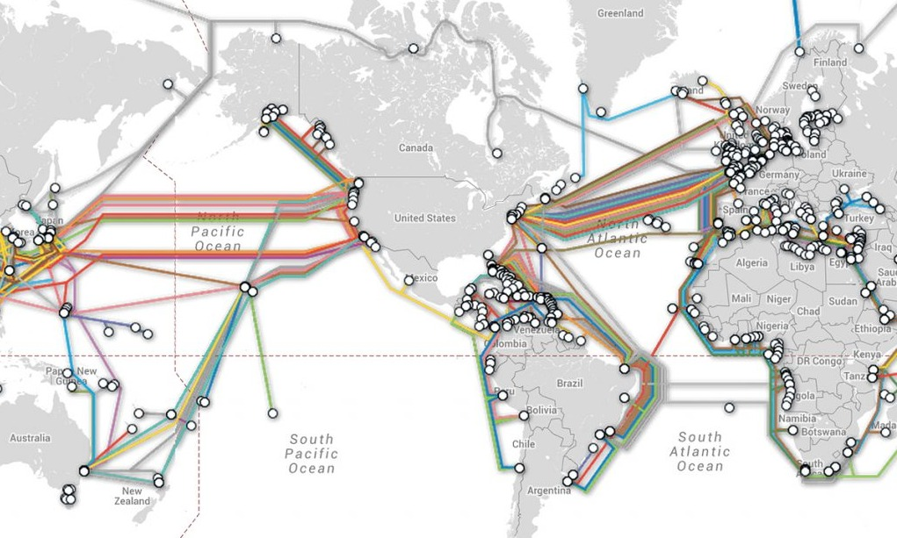

#### TCP/IP
A comunicação entre as redes espalhadas por todo o mundo é possível através do uso do conjunto de protocolos conhecido como *TCP/IP Protocol Suite*. TCP é o Protocolo de Controle de Transmissão e o IP é o Protocolo de Internet. Essa arquitetura surgiu em 1975 na rede Arpanet

É formada por quatro camadas, e cada camada possui as suas responsabilidades bem definidas, fornecendo serviços para as camadas superiores:
* Camada de Aplicação
* Camada de Transporte
* Camada de Rede
* Camada de Interface
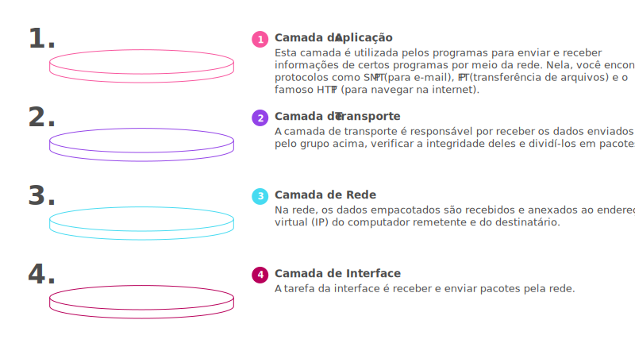

Em uma rede TCP/IP cada equipamento conectado à rede deve possuir um endereço único, capaz de identificá-lo. Esses endereços, chamados de endereços IP, permitem a entrega das informações aos seus destinos de forma correta e eficiente (Exemplo de um endereço IP: 128.32.99.5)

#### Domínios
Quando um usuário acessa um site através do browser, normalmente ele digita um endereço diferente do de IP. Para facilitar a memorização dos endereços de equipamentos conectados à internet utilizamos os nomes de domínios, que permite a tradução para um endereço IP

A associação de nomes de domínio para um endereço IP é feita por um conjunto de servidores de DNS - Domain Name Services ou Sistema de Nomes de Domínio. O DNS está estruturado em dois pontos básicos:
* Organização da Internet em Domínios
* Distribuição dos Servidores DNS na Internet

A organização da internet em domínio tem como objetivo evitar a reutilização de um mesmo nome por mais de um equipamento conectado à internet e descentralizar o cadastramento dos mesmos. Assim, cada país possui uma entidade responsável por atribuir endereços de IP e fazer a sua associação com um nome
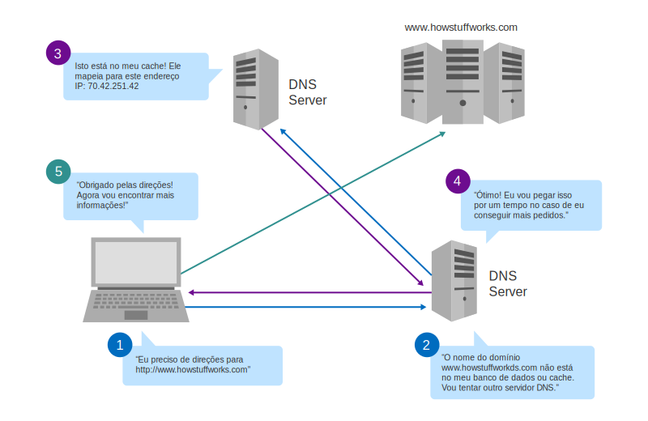

#### Serviços disponíveis na internet
Existem diversos serviços disponíveis na internet. O ponto em comum entre os serviços disponíveis é o modelo de implementação: cliente-servidor. Nesse modelo, os serviços são disponibilizados em programas-servidores, e o usuário acessa esses programas através da internet utilizando programas-clientes. Os principais serviços disponíveis atualmente na internet são:
* World Wide Web
* FTP
* E-mail

##### World Wide Web (www)
Serviço de acesso a informações por hipertexto. A busca e obtenção de informações utiliza um mecanismo de navegação conhecido por hipertexto, que cria a imagem de uma teia que interliga documentos pela internet. vem daí o nome, que traduzido fica *teia de alcance mundial*.

A estrutura dos documentos é desenvolvida através da linguagem HTML (HyperText Markup Language), que permite a ligação com outros documentos (hiperlinks). Um documento HTML é localizado na WWW por um identificador conhecido como Universal Resource Location (URL), que identifica o tipo de serviço, o endereço do servidor e onde o documento está, dentro desse servidor.
* https://www.fiap.com.br/home.html
  * **http** (HyperText Transfer Protocol) é um protocolo de comunicação para a transmissão de documentos de hipertext (HTML) na WWW. Ela está presente na camada de aplicação da arquitetura TCP/IP
  * **www.fiap.com.br** é o nome de domínio, que será traduzido por um servidor de DNS para o endereço de IP do servidor onde está instalado o site da FIAP
  * **home.html** é o nome do documento que queremos visualizar
Os equipamentos que disponibilizam os documentos html precisam utlizar programas servidores WWW, dessa forma é possível solicitar a informação de um documento para o servidor através da url.
Para o usuário acessar o serviço WWW, é necessário a utilização de um programa-cliente denominado browser ou navegador, nele é possível inserir a url da página que queremos acessar , após isso, o browser recebe as informações, interpreta e exibe a página html.
* Funcionamento da WWW:
  * O usuário insere no browser a URL da página que deseja acessar
  * O nome de domínio é traduzido para o endereço de IP do servidor
  * Com o endereço de IP, o browser envia uma requisição HTTP para o servidor
  * O servidor processa a requisição e envia uma resposta HTTP com as informações da página HTML
  * O browser recebe a resposta, interpreta o documento html e mostra a página para o usuário

##### FTP - Sistema de transferência de arquivos
File Transfer Protocol, ou Protocolo de transferência de arquivos é o serviço padrão da internet para a transferência de arquivos entre computadores. O funcionamento do FTP se baseia no estabelecimento de uma comunicação entre o cliente FTP e o servidor FTP remoto, o que torna possível navegar na estrutura de diretórios do servidor FTP e executar comandos para a manipulação de diretórios e arquivos.

##### E-mail - Serviços de correio eletrônico
Correio eletrônico é outro serviço da internet que tem por objetivo a comunicação e troca de dados entre computadores. O funcionamento desses serviços tem como base um endereço conhecido como e-mail address ou endereço de correio eletrônico. Esse endereço é formado pelo *usuario@dominio*. O usuário representa o identificador de uma caixa postal e o domínio representa o nome de domínio para localizar o equipamento que possui a caixa postal.

Esses serviços são baseados nos protocolos POP3, IMAP e SMTP que estão presentes também na camada de aplicação e são utilizados para enviar e receber as mensagens dos servidores de e-mail.

##### W3C e Web Standards
A W3C ou World Wide Web Consortium foi criada em 1994, trata-se de uma organização internacional formada por empresas, instituições, pesquisadores e desenvolvedores. Uma equipe em tempo integral e o público trabalham juntos para desenvolver a web em sua potência máxima, criando normas e especificações aplicáveis aos diversos segmentos e setores da web. Esses padrões são chamados de Padrões Web ou Web Standards.

A definição dada pelo W3C para Web Standards pode ser assim traduzida: 
> Web Standards é um conjunto de normas, diretrizes, remomendações, notas, artigos, tutoriais e afins de caráter técnico, produzidos pelo W3C e destinados a orientar fabricantes, desenvolvedores e projetistas para o uso de práticas que possibilitem a criação de uma Web acessível a todos, independentemetne dos dispositivos usados ou de suas necessidades especiais

Esses documentos estão disponíveis no site da [w3c](https://www.w3.org)

#### Desenvolvimento em Camadas
* Podemos dividir o desenvolvimento de páginas web em 3 camadas

| Camada | Linguagem | Objetivo |
| :----: | :-------: | :------: |
|Estrutura dos dados (Conteúdo)|HTML|Estruturar as informações das páginas|
|Apresentação|CSS|Formatação de apresentação do conteúdo: *layout, cores, fontes etc.*|
Comportação|Javascript|Adiciona interatividade e controle aos elementos do HTML|

* Porque separar o desenvolvimento em camadas?
  * Reaproveitamento de código
    * Em programação, repetição de código significa que algo não está sendo feito da melhor forma possível. Separar código CSS e Javascript permite a reutilização do código em várias páginas HTML
  * Organização da equipe
    * A separação em camadas facilita a divisão de tarefas. Mais de uma pessoa trabalhando em paraleleo no mesmo projeto agiliza o processo
  * Limpeza de código
    * Um código limpo facilita a leitura e consequentemente, a manutenção e a evolução

##### Sites e sistemas Web

Não existe uma definição exata para diferenciar sites de aplicações web. Já que os dois estão disponíveis na internet e podem ser utilizados através de dispositivos que possuam um navegador (Browser).

Alguns defendem que nos sites o usuário pode somente visualizar conteúdos, enquanto que nos sistemas web é possível visualizar e também inserir dados. Nessa definição, os sistes apenas fornecem conteúdo e as aplicações web podem fornecer e/ou receber informações.

Com essa linha de pensamento, algumas pessoas gostam de utilizar o grau de interatividade com os usuários para classificar como site ou sistema web. Assim, as aplicações web são mais interativas, com a entrada de informações para o seu processamento, e os sites são menos interativos.
Existe outra forma para determinar se é um site ou uma aplicação web. Se o objetivo é divulgar informações de uma empresa, produtos ou um determinado assunto, o termo é site. Se o propósito é criar uma ferramenta para controlar as atividades, seja de uma organização ou pessoal, utiliza-se o termo aplicação web.

Assim podemos concluir que, em geral, os sites necessitam de uma interface mais atrativa, pois estão normalmente divulgando alguma ideia ou informação. Por outro lado, na maior parte dos casos, as aplicações web se preocupam em atingir o objetivo funcional no qual foram desenvolvidos, utilizando tambem uma interface com usabilidade, ou seja, fácil de ser utilizada e compreendida


## HTML - O início
---

### Padrão de Codificação

* A linguagem deriva da metalinguagem *Standard Generalized Markup Language* (SGML), inventada pela IBM da década de 1960
* As sintaxes de marcação são informadas entre "<" (sinal de menor) e ">" (sinal de maior) e são chamadas de *tags*
  * Possuem uma hierarquia, ou seja, existem "subtags" que só devem ser posicionadas dentre de uma determinada tag "mãe"
    * Por essa razão, a maioria das tags HTML são abertas e fechadas (o fechamento usa o símbolo "/", barra)
  * Exemplo:
```html
<tag>
  <subtag atributo="valor">Informação cuja marcação atuará</subtag>
</tag>
```
* Tags possuem atributos que possibilitam a parametrização de efeito gerado pela tag

### Tags Essenciais

#### Tag ```<!DOCTYPE>```
* O *Document Type Definition* (DTD) ou a tag ```<!DOCTYPE>``` não é exatamente parte do padrão HTML, mas é muito importante
  * Existem vários padrões HTML, mas como o navegador do usuário sabe em qual destes padrões o documento foi escrito? Bem, ele não sabe, ele "adivinha" qual é, e nem sempre acerta
* É a primeira tag de um documento, colocada antes mesmo da ```<html>```
* Existem dezenas de doctypes diferentes que ao serem interpretadas pelo navegador não só determinam o padrão a ser seguido, como ativam modos de renderização diferentes: *standards mode* é seu modo peculiar de renderização, *quirks mode* é utilizado para páginas antigas ou o modo intermediário quase padronizado conhecido como *almost standards mode*
* Para o padrão HTML5, a tag foi devidamente encurtada, não exigindo especificação DTD determinada. A linha de código fica assim: ```<!DOCTYPE html>```

#### Tag ```<html>```
* Determina onde começa e termina o documento HTML
* Todas as outras tags devem ser contidas dentro dela
* No padrão HTML5: ```<html lang="pt-br"></html>```
  * O atributo lang é global, ou seja, pode ser utilizado em qualquer tag da linguagem. Entretanto, é mais comum que seja informada em ```<html>```, determinando assim o idioma do documento todo
  * Se o idioma não for indicado aqui, o navegador tenta adivinhar qual é, podendo falhar miseravelmente. Além disso, mecanismos de busca se beneficiam desta indicação de idioma
    * Algoritmos do Google dão preferência a buscas orgânicas para documentos cujo **lang** é utilizado, ou seja, é absolutamente obrigatório

#### Atributos Globais
* São aqueles que podem ser aplicados em qualquer elemento/tag HTML
  * **acceskey**
    * Com ele, é possível determinar um teclado de atalho para o elemento; ao digitar usando a tecla aqui informada, o elemento HTML em questão ganha foco
  * **class**
    * Este atributo é relacionado com o CSS, que falaremos adiante. Deve ser usado para informar a classe que será utilizada para estilizar o elemento em quetão
  * **id**
    * Utilizado para informar o identificador único do elemento, ou seja, nenhum outro elemento poderá ter o mesmo id 
  * **lang**
    * Determina o idioma utilizado dentro do elemento HTML
  * **style**
    * Utilizado para aplicar estilos no padrão CSS diretamente no elemento
    * O valor dentro deste atributo é linguagem CSS pura
    * **style** não é a solução ideal, prefira usar o atributo **class**
  * **tabindex**
    * Por questões de rapidez (ou pela falta do mouse), alguns usuários gostam de navegar entre os elementos HTML usando a tecla TAB do teclado, aliás, esta forma de navegação é utilizada por deficientes visuais
    * Conforme a tecla TAB é acionada, um novo elemento HTML ganha foco
    * É possível modificar a ourdem atribuindo números (começando em 0, sendo este o primeiro elemento do documento a ganhar foco), assim, a navegação por TAB pode ser inteiramente personalizada
  * **title**
    * Representa informações do elemento, como uma dica (ou *tooltip*)
      * No caso de um hiperlink, pode ser o título ou uma descrição do destino; no caso de uma imagem, pode ser seu crédito ou uma descrição da imagem (essencial para leitores de tela de deficientes visuais); no caso de um parágrafo, pode ser uma nota de rodapé ou comentário sobre o texto

#### Tag ```<head>```
* Determina o cabeçalho do documento
* Serve como um container de outras tags importantes para o documento, mas não fazem parte do corpo deste

```html
<!DOCTYPE html>
<html lang="pt-br">
  <head>
  </head>
</html>
```

#### Tag ```<title>```
* Utilizada para informar o título do documento
* Como faz parte do cabeçalho ```<head>```, este título não é renderizado em tela - somente as que fazem parte do corpo serão
* Trata-se do título que será utilizado pelos mecanismos de buscas, topo e abas do seu navegador

```html
<!DOCTYPE html>
<html lang="pt-br">
  <head>
    <title>Exemplo de Título</title>
  </head>
</html>
```
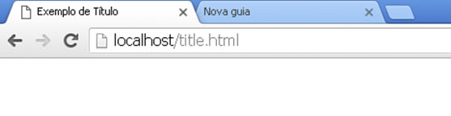

#### Tag ```<link>```
* *Não é a tag dos tradicionais hiperlinks clicáveis: a que faz isso é a tag ```<a>```*
* Essa tag é filha de ```<head>```
* Serve para vincular documentos de vários tipos como, por exemplo, os documenots CSS e Javascript
* Não possui uma tag de fechamento, isso acontece porque ela não está marcando um trecho de texto, não existe conteúdo a ser contido

```html
<!DOCTYPE html>
<html lang="pt-br">
  <head>
    <title>Exemplo de Título</title>
    <link rel="stylesheet" type="text/css" href="css/principal.css" title="Estilos principais">
    <link rel="stylesheet" type="text/css" href="css/titulos.css" title="Titulos">  
  </head>
</html>
```
* Principais atributos
  * **href**
    * Abreviação de *hyperlink reference*
    * Trata-se do endereço do arquivo que está sendo vinculado
    * O endereço pode ser:
      * *Absoluto* - Caso estejamos acessando um arquivo externo como http//www.outrosite.com.br/css/estilis.css
      * *Relativo* - Toma como referência o diretório em que o documento HTML está como base
        * Por exemplo, href="arquivos.css" significa que o arquivo CSS etá no mesmo diretório que o documento HTML que lhe faz referência. Já href="../css/arquivos.css" significa que o arquivo alvo está em uma pasta (chamada css) no diretório superior ao do documento HTML
  * **rel**
    * Especifica o tipo de documento sendo vinculado
    * Varios tipos podem ser declarados, como uma folha de estilo CSS (*stylesheet*) ou um ícone (*icon*) por exemplo
  * **type**
    * Tipo MIME de documento vinculado ("text/css" no caso de CSS)

```html
<!DOCTYPE html>
<html lang="pt-br">
  <head>
    <title>Exemplo de Título</title>
    <!-- IE, sempre você... -->
    <link rel="shortcut icon" type="image/x-icon" href="imagens/html5.ico" />
    <!-- todos os outros navegadores -->
    <link rel="icon" type="image/x-icon" href="imagens/html5.ico" />
  </head>
</html>
```
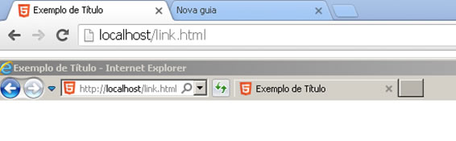
* Ests é uma das ocasiões em que o Internet Explorer diverge do padrão: ele espera que o rel informado seja "shortcut icon", enquanto enquanto todos os outros navegadores esperam o valor "icon"
* A propósito, isso é uma tag de ```<!--Comentário-->```, ela não é executada no navegador

#### Tag ```<meta>```
* Utilizada para informar os metadados do documento
* assimm como ```<link>``` não possui fechamento
* Seu uso tem várias aplicações
  * **Padrão de codificação de caracteres**
    * Existem dezenas de padrões de codificação de caracteres, pois temos diversos alfabetos e padrões diferentes de escrita no mundo todo. O padrão utilizado no Brasil é o "iso-8859-1", conhecido em outros meios como "latin1"
    * Existe, no entanto, um padrão unificado, conhecido como "utf-8", que tem sido amplamente aceito pelos principais portais brasileiros
  * Não usar a tag para informar o padrão de codificação fará com que o navegador procure adivinhá-lo
    * O atributo **charset** deve ser utilizado para esse fim

```html
<!DOCTYPE html>
<html lang="pt-br">
  <head>
    <title>Exemplo meta</title>
    <meta charset="utf-8">
  </head>
</html>
```
  * **Recarregar a página html**
    * Usando os atributos *http-equiv* e *content*, podemos definir a rotina de recarga automática da página. O valor de *http-equiv* será "Refresh" e o *content* armazena o número de segundos para a recarga. O exemplo a seguir recarrega após 5 minutos:

```html
<!DOCTYPE html>
<html lang="pt-br">
  <head>
    <title>Exemplo meta </title>
    <meta http-equiv="Refresh" content="300">
  </head>
</html>
```
  * **Palavras chave do documento**
    * Com os atributos *name* e *content*, podemos utilizar a tag para armazenar as palavras-chave do conteúdo. Informá-las é importante do ponto de vista SEO, mas é interessante ressaltar que essa tag é apenas um dos fatores analisado pelos motores de busca

```html
<!DOCTYPE html>
<html lang="pt-br">
  <head>
    <title>Exemplo meta</title>
    <meta name="keywords" content="fiap, exemplo, html">
  </head>
</html>
```

#### Tag `<style>`
* Permite aplicar estilos CSS diretamente no documento
  * A boa prática é, no entanto, criar um arquivo .css separado e vinculá-lo com a tag `<link>`

```html
<!DOCTYPE html>
<html lang="pt-br">
  <head>
    <title>Exemplo de Título</title>
    <meta name="keywords" content="fiap, exemplo, html">
    <style>
        body { background-color: black; }
    </style>
  </head>
  <body>
  </body>
</html>
```
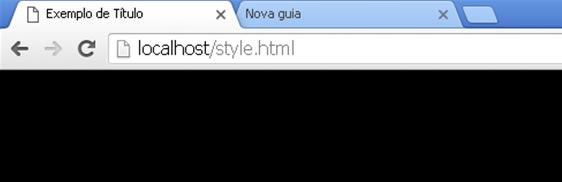

#### Tag `<script>`
* Utilizada para inserir comandos de linguagem do tipo script que seja interpretado pelo navegador. Resumidamente, JavaScript
* Os comandos da linguagem ficam entre as tags `<script>`, definindo a linguagem "text/javascript" utilizando o atributo "type"
  * Isso era necessário, pois no passado exibiam outras opções de linguagem do tipo script, como o VBScript

```html
<!DOCTYPE html>
<html lang="pt-br">
  <head>
    <title>Exemplo JavaScript</title>
  </head>
  <body>
  </body>
</html>
<script type="text/javascript">
  window.alert("Olá, mundo!");
</script>
```
* A boa prática é separar o HTML do JavaScript, criando um arquivo de extensão .js a parte e vinculando-o ao documento, utilizando o atributo "src" (*source*)

```html
<!DOCTYPE html>
<html lang="pt-br">
  <head>
    <title>Exemplo JavaScript</title>
    <script type="text/javascript" src="arquivo.js"></script>
  </head>
  <body>
  </body>
</html>
```

#### Tag `<body>`
* Determina o corpo de u documento HTML

```html
<!DOCTYPE html>
<html lang="pt-br">
  <head>
    <title>Exemplo de body</title>
    <meta charset="utf-8">
  </head>
  <body>
  </body>
</html>
```

### Tags básicas

#### Tag `<p>`
* Utilizada para definir o início e o fim de um parágrafo
  * Navegadores atribuem automaticamente uma margem entre um parágrafo e outro, que pode ser eliminada ou até mesmo aumentada usando CSS

```html
<!DOCTYPE html>
<html lang="pt-br">
  <head>
    <title>Exemplo de Parágrafo</title>
    <meta charset="utf-8">
  </head>
  <body>
    <p>Primeiro parágrafo</p>
    <p>Segundo parágrafo</p>
  </body>
</html>
```
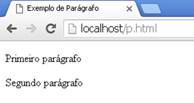

#### Tag `<br>`
* Vem da palavra *breakline*, ou seja, quebra de linha, utilizado antes para "pular" de linha
* Não possui versão de fachamento

```html
<!DOCTYPE html>
<html lang="pt-br">
  <head>
    <title>Exemplo de quebra de linha</title>
    <meta charset="utf-8">
  </head>
  <body>
    Linha 1<br>
    Linha 2<br>
    Linha3
  </body>
</html>
```
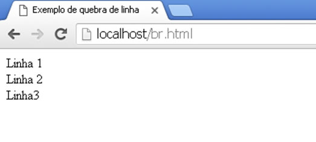

#### Tags `<h1>`, `<h2>`, `<h3>` ... até `<h6>`
* Trata-se de tags específicas para títulos e subtítulos, sendo possível, portanto, subdividir conteúdos até umm sexto nível

```html
<!DOCTYPE html>
<html lang="pt-br">
  <head>
    <title>Exemplo h1 até h6</title>
    <meta charset="utf-8">
  </head>
  <body>
    <h1>1. Título</h1>
    <p> Introdução do capítulo</p>
    
    <h2>1.1. Subtítulo</h2>
    <p> Introdução desta seção</p>

    <h3>1.1.1. Subtítulo</h3>
    <p> Introdução desta subseção</p>
  </body>
</html>
```
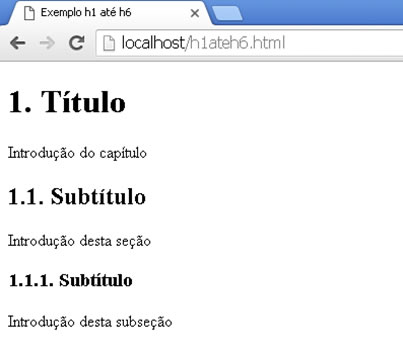
* Repare que o tamanho e estilos das tags são diferentes, `<h1>` possuindo uma tamanho maior que o `<h2>`, que tem um tamanho maior que `<h3>` e assim por diante
* Muitos diagramadores HTML acabam usando, por exemplo, `<h3>` como título, sem que haja um `<h2>` e `<h1>`, julgando o tamanho dos anteriores grande demais para seu documento. *Trata-se de um equívoco*: existe uma hierarquia entre estas tags. Se a estilização padrão for grande demais para você, altere-a usando CSS

#### Tag ``
* É utilizada para aplicar imagens ao documento HTML
* Principais atributos:
  * **src**
    * Utilizado para informar o caminho da imagem, podendo esse ser relativo ou absoluto
  * **width** e **height**
    * Trata-se do comprimento e altura da imagem, respectivamente.
    * Muitos diagramadores utilizam estes atributos para realizar um redimensionamento da imagem, aumentando-a (com resultados precários, deixam a imagem "pixelada") ou diminuindo-a, o que é ainda mais grave: usar uma imagem grande demais e redimensiona-la no HTML não torna a imagem de origem menor; o arquivo, pesado, terá que ser baixado pelo usuário, causando problemas de performance. Aconselha-se a criar arquivos diferente da mesma imagem em dimensões diferentes, quantas forem necessárias para uso
    * Se, caso a imagem de origem não for lacalizada, estes atributos garantem que o comprimento e altura sejam reservados para o local que a imagem ocuparia, evitando que haja uma quebra de diagramação do documento
  * **alt**
    * Texto alternativo da imagem
      * É esse texto que é apresentado se a imagem de origem não for localizada; o texto assume o lugar da imagem. É esse mesmo texto que será utilizado pelo leitor de tela de um deficiente visual, que poderá receber uma descriçao da imagem que não pode ver

```html
<!DOCTYPE html>
<html lang="pt-br">
  <head>
    <title>Exemplo de imagem</title>
    <meta charset="utf-8">
  </head>
  <body>
      </body>
</html>
```
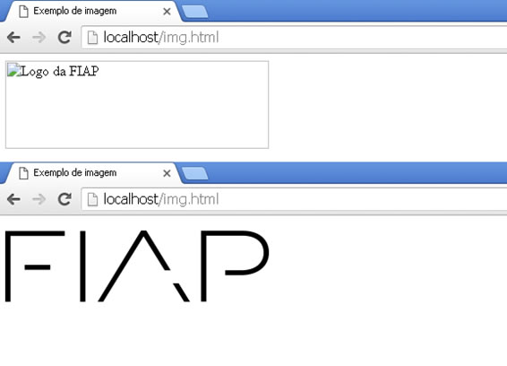

#### Tag `<div>`
* Representa uma divisão ou seção do documento
* Container utilizado para agrupar elementos como textos e imagens. Com o CSS, este container pode ser posicionado em qualquer parte da página (estéticamente dizendo), tornando-se uma verdadeira revolução na diagramação de páginas

```html
<!DOCTYPE html>
<html lang="pt-br">
  <head>
    <title>Exemplo de div</title>
    <meta charset="utf-8">
  </head>
  <body>
    <div class="artigo">Conteúdo Teste representando um artigo.</div>
  </body>
</html>
```
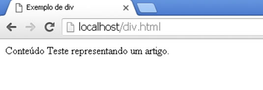

##### Substitutos do `<div>` para melhorar a semântica
* Mitos autores encorejam fortemente o uso das novas tags que foram criadas no HTML5, reservando `<div>` apenas nos casos em que estas novas tags não parecem ser aplicáveis
* Todas se comportam como a `<div>`, mas facilitam a manutanção dos documentos, além de melhorar a compreensão do texto por parte dos mecanismos de busca
* São elas:
  * `<section>`
    * Representa a seção de um documento ou página, podem ser capítulos ou seções de uma tese
  * `<nav>`
    * Um container de links para navegação, como um menu
  * `<article>`
    * Contém o artigo propriamente dito, trata-se do conteúdo próprio do documento, podendo ser um artigo de jornal ou revista, uma postagem de fórum, entre outros
  * `<aside>`
    * Este container ficará ao lado, tangenciando o conteúdo principal (geralmente um artigo), pode ser usado para publicidade ou um conteúdo de menor importância, pois a tag é um dos primeiros elementos a sumir em dimensões de tela menores, quando nos referimos a um layout responsivo
  * `<hgroup>`
    * É o título da seção, por ser um agrupamento, pode conter tags `<h1>` até `<h6>`, contendo assim subtítulos, por exemplo
  * `<header>`
    * Container de cabeçalho do documento (ou de um artigo), pode possuir menu de navegação (`<nav>`), o título (com o elemento `<hgroup>` e/ou `<h1>`-`<h6>`), entre outros
  * `<main>`
    * Container do conteúdo principal do documento
  * `<footer>`
    * Geralmente utilizada no final de uma seção, representam o redapé de uma seção ou do documento como um todo, podem conter links relacionados, referências de direitos autorais, entre outros
  * `<time>`
    * Representa não só a hora, mas uma data do calendário gragoriano; é muit útil aos mecanismos de busca, pois indica a idade da informação ali contida (considerando que será usado em um contaxto, como um artigo)
  * `<mark>`
    * Serve para dar ênfase ou destaque em uma parte do texto ou documento, como referência
  * `<figure>`
    * Indica  presença de uma figura no container, podendo conter uma legenda
  * `<figcaption>`
    * Legenda de uma figura, deve ser usado dentro da tag `<figure>`

```html
<!DOCTYPE html>
<html lang="pt-br">
    <header>
        <meta charset="utf-8">
    </header>
    <body>
        <article>
            <header>
                <h1>Título do Artigo</h1>
                <p>Publicado em: <time pubdate="pubdate" datetime="2015-11-17">17 de novembro de 2015</time></p>
            </header>
            <p>Aqui começa este grande artigo...</p>
            <section>
                <h2>Subseção do Artigo</h2>
                <p>Aqui entra uma subseção...</p>
            </section>
            <section>
                <h2>Outra subseção do Artigo</h2>
                <p>Aqui entra outra subseção...</p>
                <figure>
                    
                    <figcaption>Figura importante da seção</figcaption>
                </figure>
            </section>
            <footer>
                <p>Creative Commons Attribution-ShareAlike License</p>
            </footer>
        </article>
    </body>
</html>
```

#### Tag `<a>`
* Utilizada para fazer uma âncora de hyperlink, ou seja, o hyperlink propriamente dito
* Principais atributos:
  * **href**
    * *hyperlink reference*, ou seja, o endereço do documento em que o usuário será direcionado caso clique o link
    * Pode ser relativo ou absoluto
  * **download**
    * A presença deste atributo na tag indica que o autor deseja que o usuário baixe o documento (seja ele HTML ou não) ao invés de ser direcionado a ele
  * **rel**
    * Utilizado para qualificar o relacionamento entre os documentos vinculados
  * **target**
    * Define o alvo do hyperlink
    * O valor padrão é "_self", ou seja, ao clicar no hyperlink, a página ou documento informado em *href* será carregado na mesma janela em que o documento atual está; outras possibilidades são "_blank", cujo destino é aberto em uma nova janela ou aba, "_parent", documento abre no frame pai (quando há uso de frames), "_top", documento de destino ignora a divisão de frames da tela e abre em toda a área de janela desponível, e, finalmente, podemos informar o nome do frame, o qual desejamos que a página ou documento destino seja aberto

```html
<!DOCTYPE html>
<html lang="pt-br">
  <head>
    <title>Exemplo de hyperlink</title>
    <meta charset="utf-8">
  </head>
  <body>
    <a href="outra pagina">Link para outra página</a>
  </body>
</html>
```
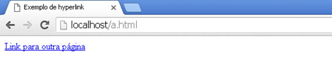
* Imagens podem ser usadas como hyperlink, combinando as tags `<a>` e ``:

```html
<!DOCTYPE html>
<html lang="pt-br">
    <head>
        <title>Exemplo de hyperlink</title>
        <meta charset="utf-8">
    </head>
    <body>
        <a href="http://www.fiap.com.br/">
            
        </a>
    </body>
</html>
```
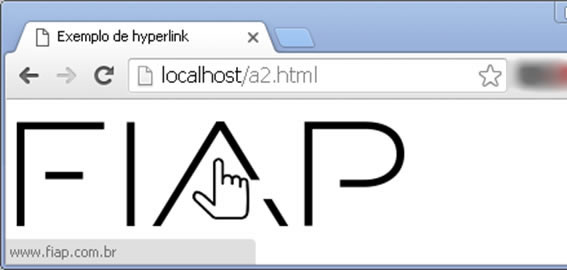

#### Tags `<ol>`, `<ul>` e `<li>`
* As tags `<ol>` e `<ul>` são utilizadas para a criação de listas ordenadas e não ordenadas, respectivamente
* A tag `<li>` é utilizada para os itens da lista, independente do formato
* Exemplo de lista ordenada:
```html
<!DOCTYPE html>
<html lang="pt-br">
  <head>
    <title>Exemplo de ol</title>
    <meta charset="utf-8">
  </head>
  <body>
    <ol>
      <li value="1">Teste 1</li>
      <li value="2">Teste 2</li>
      <li value="3">Teste 3</li>
    </ol>
  </body>
</html>
```
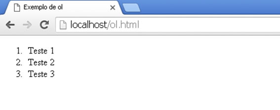
* Exemplo de lista não ordenada:
```html
<!DOCTYPE html>
<html lang="pt-br">
  <head>
    <title>Exemplo de ul</title>
    <meta charset="utf-8">
  </head>
  <body>
    <ul>
      <li>Teste 1</li>
      <li>Teste 2</li>
      <li>Teste 3</li>
    </ul>
  </body>
</html>
```
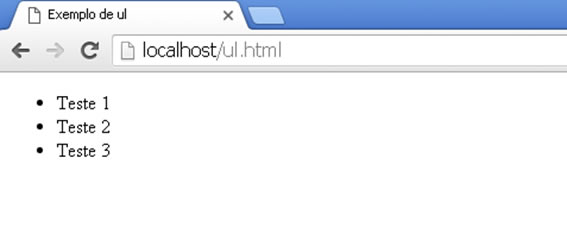

#### Tag `<iframe>`
* Permite criar uma janela dentro do documento HTML na qual é possível abrir outro documento HTML
* Principais atributos:
  * **width**
    * Comprimento da janela
  * **height**
    * Altura da janela
  * **name**
    * Nome da janela
* No exemplo a seguir, ela precisa de  3 documentos para funcionar: iframe_pagina1.hml, iframe_pagina2.html e iframe.html. Este último possui um iframe que carregará previamente a primeira página, e possui um link com target: ao clicar, a página 2 será aberta dentro do iframe
```html
<!DOCTYPE html>
<html lang="pt-br">
  <head>
    <title>Exemplo de iframe</title>
    <meta charset="utf-8">
  </head>
  <body>Página 1</body>
</html>
```

```html
<!DOCTYPE html>
<html lang="pt-br">
  <head>
    <title>Exemplo de iframe</title>
    <meta charset="utf-8">
  </head>
  <body>Página 2</body>
</html>
```

```html
<!DOCTYPE html>
<html lang="pt-br">
  <head>
    <title>Exemplo de iframe</title>
    <meta charset="utf-8">
  </head>
  <body>
	<a href="iframe_pagina2.html" target="janela">Clique aqui para abrir a página 2 dentro do iframe</a>
	<br><br>
	Iframe abaixo:
	<iframe name="janela" width="100" height="100" src="iframe_pagina1.html">
	</iframe>
  </body>
</html>
```
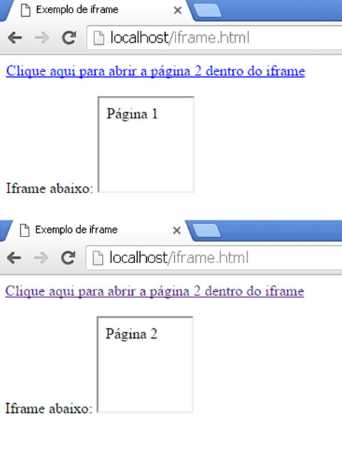

#### Tags `<frame>` e `<frameset>`: Por que não usar?
* As tags em questão permitem dividir uma janela de um navegador em vários pedaços, possibilitando a abertura de vários documentos HTML distintos e ao mesmo tempo. Usados à exaustão nas décadas de 1990 e início da década seguinte, pesam semais na perfirmance e são de difícil controle: cada janela é batizada com um nome e os hyperlinks com a tag `<a>` devem usar o atributo *target* para abrir conteúdos nas outras janelas

#### Tags de marcação a se esquecer
* Em seus primórdios, existiam tags importantes para a marcação de texto, como as tags `<font>` (formtação de fontes de texto), `<big>` (fonte maior), `<small>` (fonte menor), `<b>` (negrito), `<i>` (itálico), `<s>` (tachado), e `<u>` (sublinhado). com exceção de `<b>`, `<i>` e `<u>`, todas as tags mencionadas foram descontinuadas no HTML5. A razão é que a melhor forma de se estilizar texto se chama CSS: mais organizado, e a possibilidade de reuso dos estilos. Esqueça que estas tags existem (ou existiram): utilize a tag `<div>` ou uma tag conhecida como `<span>` com o aributo class e deixe tudo a cargo do css

### Tabulação de dados: Criando tabelas
* Utilizar para determinar o início e o fim (`</table>`) de uma tabela
* Embora possamos utilizar os atributos **width** e **height** para dimensionar a tabela, alén de alinhá-la usando **align** e a possibilidade de determinar a espassura de sua borda com **border**, tudo isso pode ser feito com melhores resultados usando CSS

```html
<!DOCTYPE html>
<html lang="pt-br">
  <head>
    <title>Exemplo de tabela</title>
    <meta charset="utf-8">
  </head>
  <body>
    <table width="100%" height="200">
    </table>
  </body>
</html>
```

#### Tags `<thead>`, `<tbody>` e `<tfoot>`
* Consideradas opcionais
* Ajudam a definir bem as áreas distintas de uma tabela
* `<thead>` indica o cabeçalho da tabela
* `<tbody>` seu corpo
* `<tfoot>` seu rodapé
* Segundo a especificação, as tags de finalização são consideradas opcionais. Sendo assim, o navegador compreende que o cabeçalho `<thead>` termina assim que ele encontra um `<tbody>`, e o corpo da tabela termina assim que encontra o `<tfoot>`, que termina com o final da tabela `</table>`

```html
<!DOCTYPE html>
<html lang="pt-br">
  <head>
    <title>Exemplo de tabela</title>
    <meta charset="utf-8">
  </head>
  <body>
    <table width="100%" height="200">
      <thead>
      <tbody>
      <tfoot>
    </table>
  </body>
</html>
```

#### Tag `<tr>`
* Utilizada para determinar o início e o fim (`</tr>`) de uma linha da tabela, que poderá ter inúmeras linhas

```html
<!DOCTYPE html>
<html lang="pt-br">
  <head>
    <title>Exemplo de tabela</title>
    <meta charset="utf-8">
  </head>
  <body>
    <table width="100%" height="200">
      <thead>
	  <!-- Primeira linha -->
	  <tr>
	  </tr>
	  <!-- Segunda linha -->
	  <tr>
	  </tr>
      </thead>
      <tbody>
	  <!-- Terceira linha -->
	  <tr>
	  </tr>
	  <!-- Quarta linha -->
	  <tr>
	  </tr>
	</tbody>
	<tfoot>
	  <!-- Quinta linha -->
	  <tr>
	  </tr>
	</tfoot>    
    </table>
  </body>
</html>
```

#### Tags `<td>` e `<th>`
* Ambas são utilizadas para determinar o início e o fim de uma célula de tabela
* As tebelas tem o número de colunas iigual a linha com maior quantidade de tags `<td>`
* As `<td>` devem ser usadas em células comuns, enquanto as `<th>` em células de cabeçalho
* A princípio não há diferença visual entre elas (embora alguns navegadores deixem a fonte dentro de um `<th>` em negrito), mas você pode fazê-las com CSS
* O uso do `<th>` traz outros benefícios, como repetir o cabeçalho automaticamente ao se mandar imprimir uma grande tabela

```html
<!DOCTYPE html>
<html lang="pt-br">
  <head>
    <title>Exemplo de tabela</title>
    <meta charset="utf-8">
  </head>
  <body>
    <table width="500" border="1">
      <thead>
	 <tr><!-- Primeira linha -->
	   <th>Curso</th>
	   <th>Conteudista</th>
          <th>Tutor</th>
	   <th>Realizado</th>
	 </tr>
      </thead>
      <tbody>
	 <tr><!-- Segunda linha -->
	   <td>Gamificação</td>
	   <td>Henrique Poyatos</td>
	   <td>Henrique Poyatos</td>
	   <td>Sim</td>
	 </tr>
	 <tr><!-- Terceira linha -->  
	   <td>Prototipação</td>
	   <td>Almir Alves</td>
	   <td>Almir Alves</td>
	   <td>Sim</td>		
        </tr>
      </tbody>
    </table>
  </body>
</html>
```
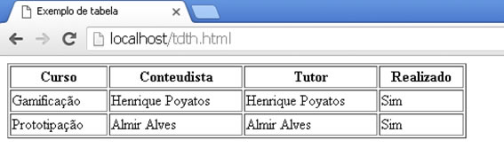

#### Mesclando Células
* As tags `<td>` e `<th>` possuem atributos que permitem mesclá-las com outras: São o **colspan** (para mesclar colunas horizantalmente) e **rowspan** (par mesclar linhas, na vertical)
* Se quisermos mesclar células precisamos colocar o atributo **colspan="2"** no `<td>` que queremos mesclar e subtrair um `<td>` de onde ocorrerá a masclagem

```html
<!DOCTYPE html>
<html lang="pt-br">
  <head>
    <title>Exemplo de tabela</title>
    <meta charset="utf-8">
  </head>
  <body>
    <table width="500" border="1">
      <thead>
        <tr><!-- Primeira linha -->
          <th width="50%">Curso</th> <!-- célula cabeçalho 1 -->
          <th>Conteudista</th> <!-- célula cabeçalho 2 -->
          <th>Tutor</th> <!-- célula cabeçalho 3 -->
          <th>Realizado</th> <!-- célula cabeçalho 4 -->
        </tr>
      </thead>
      <tbody>
	 <tr><!-- Segunda linha -->
	   <td>Gamificação</td> <!-- célula 1 -->
	   <td colspan="2">Henrique Poyatos</td> <!-- mescla horizontalmente (célula vale por dois td) -->
	   <td>Sim</td> <!-- célula 4 -->
	 </tr>
	 <tr><!-- Terceira linha -->  
	   <td>Prototipação</td> <!-- célula 1 -->
	   <td>Almir Alves</td> <!-- célula 2 -->
	   <td>Almir Alves</td><!-- célula 3 -->
	   <td>Sim</td>		<!-- célula 4 -->
        </tr>
      </tbody>
    </table>
  </body>
</html>
```
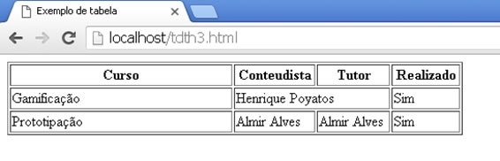
```html
<!DOCTYPE html>
<html lang="pt-br">

<head>
    <title>Exemplo de tabela</title>
    <meta charset="utf-8">
</head>

<body>
    <table width="500" border="1">
        <thead>
            <tr>
                <!-- Primeira linha -->
                <th width="50%">Curso</th> <!-- célula cabeçalho 1 -->
                <th>Conteudista</th> <!-- célula cabeçalho 2 -->
                <th>Tutor</th> <!-- célula cabeçalho 3 -->
                <th>Realizado</th> <!-- célula cabeçalho 4 -->
            </tr>
        </thead>
        <tbody>
            <tr>
                <!-- Segunda linha -->
                <td>Gamificação</td> <!-- célula 1 -->
                <td colspan="2">Henrique Poyatos</td>
                <!-- células 3 e 4 - mescla horizontalmente (célula vale por dois td) -->
                <td rowspan="2">Sim</td> <!-- célula 4 (mescla vertical)-->
            </tr>
            <tr>
                <!-- Terceira linha -->
                <td>Prototipação</td> <!-- célula 1 -->
                <td>Almir Alves</td> <!-- célula 2 -->
                <td>Almir Alves</td><!-- célula 3 -->
                <!-- célula 4 mesclada com a da linha anterior-->
            </tr>
        </tbody>
    </table>
</body>

</html>
```
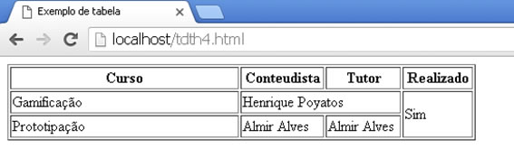

### Criando Formulários
* A principal forma de interação, no que diz respeito à entrada de dados, são os formulários. Desde as primeiras versões do HTML, são a forma mais eficaz (quando não era a única) de solicitar informações do usuário

#### Tag `<form>`
* Utilizada para determinar o início e o fim de um formulário HTML
* Além dos atributos globais, os listados a seguir estão disponíveis para parametrização
  * **accept-charset**
    * Utilizado para armazenar o padrão de caracteres que será usado ao submeter o formulário;
      * Procure usar utf-8 e, em último caso, iso-8859-1
  * **action**
    * Utilizado para armazenar o endereço internet (URL) no qual o formulário será submetido
    * Embora aceite caminhos absolutos (além dos relativos), o ideal é que esta URL de tratamento do formulário esteja em um mesmo domínio, caso contrário, teremos uma falha na segurança conhecida como **cross-origin**
  * **autocomplete**
    * Permite que as funcionalidades de autocommpletar presentes no navegador auxiliem o usuário no preenchimento do formulário
  * **enctype**
    * Define qual o tipo de codificação será utilizada para submeter o formulário
    * O padrão é "application/x-www.form-urlencoded", opção a partir da qual os dados são preparados para fazer parte da URL (método GET de envio). As outras possibilidades são "multipart/form-data", necessário quando requerer a realização de upload de arquivos usando o formulário (os dados se tornam binários) e "text/plain", no qual espaços se tornam sinais de adição ("+") mas nenhum outro tratamento é aplicado
  * **method**
    * Define qual método HTTP será utilizado para submeter o formulário. Existem duas opções: GET e POST
      * O método **GET**, embora seja o padrão, não é a situação ideal. Ao utilizá-lo, ele passa as informações do formulário no endereço URL seguinte. Isso implica em limitações no tamanho da informação passada, além de possíveis problemas de segurança
      * No método **POST**, as informações são enviadas do corpo de mensagem do protocolo HTTP, possibilitando volumes maiores de informação, ocultando (um pouco) a informação dos usuários
      * A não ser que o protocolo usado seja HTTPS (estabelece um túnel criptografado entre cliente e servidor), seja GET ou POST, as informações são enviadas de uma forma aberta, podendo ser interceptadas por qualquer nó de rede, nal qual os pacotes HTTP são enviados. Conclusão, métodos POST são menos inseguros do que métodos GET
  * **name**
    * Define o nome que será dado ao formulário dentro da API *document.forms* (JavaScript)
    * Ótil, mas dê preferência para o atributo **id**, que é mais prático
  * **novalidate**
    * Se este atributo estiver presente (não precisa de valor definido), a validação do formulário (que acontece antes da submissão) é ignorada
  * **target**
    * Mesmo atributo apresentado na tag `<a>`

```html
<!DOCTYPE html>
<html lang="pt-br">
  <head>
    <title>Exemplo de formulário</title>
    <meta charset="utf-8">
  </head>
  <body>
    <form id="formulario" method="POST" action="processaForm.php">
    </form>
  </body>
</html>
```

#### Tag `<label>`
* Trata-se do rótulo do campo, uma descrição do que aquele elemento de formulário solicita ou representa
* Se torna eficaz quando utilizado com o atributo **for**, que permite associar o `<label>` com seu elemento de formulário (seja `<input>`, `<select>`, `<textarea>`), bastando informar o id do elemento

```html
<!DOCTYPE html>
<html lang="pt-br">
  <head>
    <title>Exemplo de formulário</title>
    <meta charset="utf-8">
  </head>
  <body>
    <form id="formulario" method="POST" action="processaForm.php">
	    <label for="nome">Nome Completo</label>
      <input type="text" id="nome"><!-- explicado na sequência -->
    </form>
  </body>
</html>
```
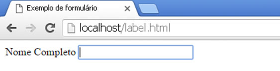
* Ao clicar no `<label>` "Nome Completo" com o mouse, a caixa de texto ganha foco imediatamente

#### Tag `<input>`
* É o principal elemento de um formulpario, e pode assumir a forma de uma caixa de texto ou um botão de seleção única ou múltipla, um botão de formulário, entre outras possibilidades
* Seus principais atributos são:
  * **accept**
    * Funciona como dica de quais tipos de arquivos serão aceitos em um elemento de upload (type="file")
  * **alt**
    * O mesmo apresentado em ``, utilizado no caso de type="image"
  * **autocomplete**
    * Habilita a fincionalidade de autopreenchimento
  * **autofocus**
    * Concede o foco ao elemento automaticamente, ao carregar a página
    * Apenas um dos elementos de formulário pode possuir este atributo
  * **checked**
    * Ao colocar este atributo em um elemento que seja type="checkbox" ou type="radio", o elemento vem marcado como padrão; do contrário, ele vem desmarcado
  * **disabled**
    * Ao colocar este atributo no elemento, ele fica insdisponível para alterações
  * **height**
    * Utilizado para definir a altura do elemento. Prefira seu equivalente em CSS
  * **width**
    * Utilizado para definir o comprimento do elemento. Prefira seu equivalente em CSS
  * **list**
    * Informa uma lista de opções para o recurso de autocompletar (utiliza a tag `<datafield>`)
  * **max**
    * Define o valor máximo que um campo do tipo numérico ou data (formato yyy-mm-dd) pode assumir
  * **min**
    * Define o valor mínimo que um campo do tipo numérico ou data pode assumir
  * **maxlength**
    * Tamanho máximo, em caracteres, esperado para o valor preenchido
  * **minlength**
    * Tamanho mínimo, em caracteres, esperado para o valor preenchido
  * **multiple**
    * Permite ao campo coletar vários valores de uma vez, campo múltiplo
  * **name**
    * Define o nome do elemento na API *form.elements* (JavaScript)
  * **pattern**
    * Permite definir um padrão em expressões regulares para validar este campo de formulário
  * **placeholder**
    * Trata-se de um rótulo visível para o usuario, posicionado dentro do elemento. Geralmente é usado como dica de preenchimento
  * **readonly**
    * ao colocar este atributo no elemento, indica que ele é apenas para leitura, e fica indisponível para alterações
  * **required**
    * Ao informá-lo, indica que o campo é de preenchimento obrigatório
  * **size**
    * Tamanho do campo em número de caracteres. Prefira usar width em CSS
  * **type**
    * **text**
      * Caixa de texto padrão
    * **hidden**
      * Campo "escondido" ou "invisível". Não é renderizado
    * **password**
      * Caixa de texto que mascara os caracteres digitados
    * **checkbox**
      * Uma caixa para seleção múltipla
    * **radio**
      * Um botão redondo para seleção única
    * **file**
      * Uma caixa de texto e botão que permite procurar arquivos no repositório local do usuário. Campo para *upload* de arquivos
    * **submit**
      * Um botão que, ao ser clicado, submete o formulário
    * **reset**
      * Um botão que, ao ser clicado, restaura o formulário para seus valores iniciais, ou seja, geralmente apaga o formulário
    * **button**
      * Um botão que não faz nada ao ser clicado; é específico para ser trabalhado usando JavaScript
    * **tel**
      * Específico para armazenar telefone
    * **url**
      * Específico para armazenar um endereço web (URL)
    * **search**
      * Específico para campo de pesquisa
    * **email**
      * Específico para armazenar um endereço de e-mail, valida automaticamente
    * **number**
      * Específico para armazenar valores numéricos
    * **date**
      * Específico para armazenar data
    * **time**
      * Específico para armazenar hora
    * **range**
      * Específico para armazenar intervalo numérico
    * **color**  
      * Específico para armazenar cores
  * **value**
    * Permite definir um valor padrão para o campo. Desta maneira, ao renderizar o formulário, o campo vem previamente preenchido
* Exemplo *value* e *disabled*
```html
<!DOCTYPE html>
<html lang="pt-br">
  <head>
    <title>Exemplo de formulário</title>
    <meta charset="utf-8">
  </head>
  <body>
    <form id="formulario" method="POST">
      <label for="nome">Nome Completo: </label>
      <input type="text" id="nome" value="João Ninguém" disabled>
    </form>
  </body>
</html>
```
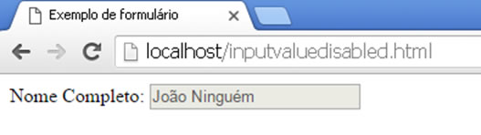
* Exemplo *checked*
```html
<!DOCTYPE html>
<html lang="pt-br">

<head>
    <title>Exemplo de formulário</title>
    <meta charset="utf-8">
</head>

<body>
    <form id="formulario" method="POST">
        <!-- Botões de escolha única -->
        <label for="estcivil">Estado Civil: </label>
        <input type="radio" name="estcivil" value="Solteiro">Solteiro
        <input type="radio" name="estcivil" value="Casado">Casado
        <input type="radio" name="estcivil" value="Viúvo" checked>Viúvo<br>

        <!-- Caixas de múltipla escolha -->
        <label for="interesses">Interesses: </label>
        <input type="checkbox" name="interesses">Música
        <input type="checkbox" name="interesses" checked>Cinema
        <input type="checkbox" name="interesses" checked>Teatro
    </form>
</body>

</html>
```
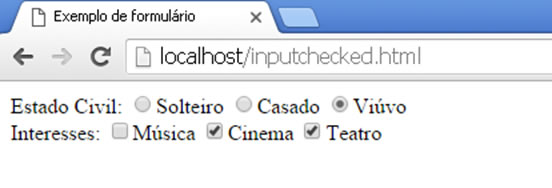
* Repare que os botões de escolha única (type="radio") possuem os mesmos atributos *name*; é desta maneira que estes botões são agrupados, permitindo que apenas um deles seja marcado
* No cado de caixas de múltipla escolha (type="checkbox"), isso é desejável, ombora não seja obrigatório
* Veja um exemplo utilizando todos os tipos de `<input>` mais tradicionais
```html
<!DOCTYPE html>
<html lang="pt-br">
  <head>
    <title>Exemplo de formulário</title>
    <meta charset="utf-8">
  </head>
  <body>
    <form id="formulario" method="POST">
        <!-- Caixa de texto -->
	  <label for="nome">Nome Completo: </label>
       
	  <!-- Caixa para senha -->
	  <label for="senha">Senha: </label>
       <input type="password" id="senha"><br>
	  <!-- Botões de escolha única -->
	  <label for="estcivil">Estado Civil: </label>
        <input type="radio" name="estcivil" value="Solteiro">Solteiro 
	  <input type="radio" name="estcivil" value="Casado">Casado 
	  <input type="radio" name="estcivil" value="Viúvo">Viúvo<br>
	  <!-- Caixas de múltipla escolha -->
	  <label for="interesses">Interesses: </label>
       <input type="checkbox" name="interesses" value="Música">Música
	  <input type="checkbox" name="interesses" value="Cinema">Cinema
	  <input type="checkbox" name="interesses" value="Teatro">Teatro<br>
	  <!-- Campo para upload -->
	  <label for="foto">Foto: </label>
    <input type="file" id="foto"><br>
    <!-- Botões -->
	  <input type="submit" value="Enviar">
	  <input type="reset" value="Limpar dados">
	  <input type="button" value="Faz nada">
	</form>
  </body>
</html>
```
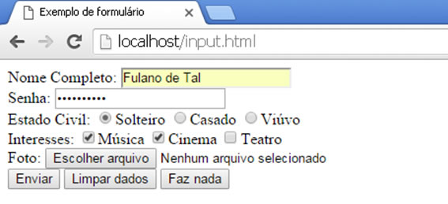

#### Tags `<select>`, `<option>` e `<optgroup>`
* Usadas para criar as caixas de seleção (conhecidas como "ComboBox")
* `<select>`
  * Define o início e o fim da lista, que pode ser parametrizada com os seguintes atributos:
    * **atributos globais, autofocus, disabled, name e required**
      * Funcionamento idêntico ao explicado na tag `<input>`
    * **multiple**
      * Permite selecionar mais de um valor na caixa de seleção
    * **size**
      * Tamanho na lista em número de linhas, transformando-a em uma lista
* `<opton>`
  * Necessária para definir as opções que o usuário terá para escolher na caixa de seleção
  * Atributos fundamentais:
    * **disabled**
      * desabilita a opção, tornando-a indisponível
    * **value**
      * Define o valor da opção, ou seja, que valor será submetido caso aquela opção for selecionada
    * **selected**
      * Permite definir uma ou mais opções (caso `<select>` seja multiple) que começarão previamente selecionados
* Exemplo:
```html
<!DOCTYPE html>
<html lang="pt-br">
  <head>
    <title>Exemplo de formulário</title>
    <meta charset="utf-8">
  </head>
  <body>
    <form id="formulario" method="POST">
	  <select id="estcivil" name="estcivil">
	    <option value="S">Solteiro</option>
	    <option value="C">Casado</option>
	    <option value="V" selected>Viúvo</option>
	    <option value="D">Divorciado</option>
	  </select>
	</form>
  </body>
</html>
```
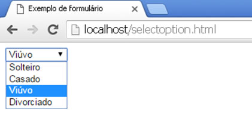
* Caso esse formulário fosse submetido, apenas as iniciais dos estados civis seriam enviadas adiante, bem diferente do rótulo visível ao usuário, contido dentro da tag <option>
* `<optgroup>`
  * Agrupa as opções em categorias
```html
<!DOCTYPE html>
<html lang="pt-br">
  <head>
    <title>Exemplo de formulário</title>
    <meta charset="utf-8">
  </head>
  <body>
    <form id="formulario" method="POST">
	  <label for="carros">Carros preferidos</label>
	  <select id="carros" name="carros" size="8" multiple>
	    <optgroup label="FIAT">
		 <option value="500">500</option>
		 <option value="Uno">Palio</option>
            <option value="Uno">Uno</option>
          </optgroup>
          <optgroup label="FORD">
            <option value="Fiesta">Fiesta</option>
            <option value="Focus">Focus</option>
            <option value="Ka">Ka</option>
          </optgroup> 
	  </select>
	</form>
  </body>
</html>
```
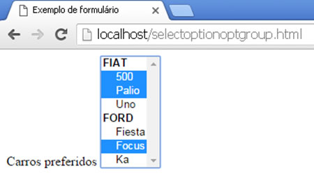

#### Tag `<textarea>`
* Utilizado quando é necessário que o usuário escreva um longo texto, grande demais para caixas de texto comuns
* Principais atributos:
  * **atributos globais, autocomplete, autofocus, disabled, maxlength, minlength, name, placeholder, readonly e required**
    * Funcionamento idêntico ao explicado na tag `<input>`
  * **cols**
    * Define o número de colunas, seu tamanho na horizontal (prefira width no CSS)
  * **rows**
    * Define o número de linhas, seu tamanho na vertical (prefira height no CSS)
* Não possue o atributo value: O valor padrão do compo deve ser contido dentro da tag, ou seja, entre `<textarea>` e `</textarea>`
```html
<!DOCTYPE html>
<html lang="pt-br">
  <head>
    <title>Exemplo de formulário</title>
    <meta charset="utf-8">
  </head>
  <body>
    <form id="formulario" method="POST">
      <label for="obs">Observações</label><br>
      <textarea id="obs" rows="5" cols="50">Texto de exemplo.</textarea>
    </form>
  </body>
</html>
```
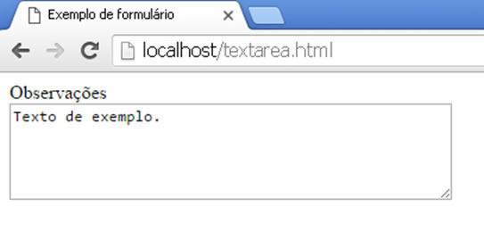

#### Tags `<fieldset>` e `<legend>`
* Possibilitam um agrupamento de campos de um formulário
```html
<!DOCTYPE html>
<html lang="pt-br">
  <head>
    <title>Exemplo de formulário</title>
    <meta charset="utf-8">
  </head>
  <body>
    <form id="formulario" method="POST">
      <fieldset>
        <legend>Dados pessoais</legend>
        <label for="nome">Nome Completo:</label>
        <input type="text" id="nome"><br>
      
        <label for="idade">Idade:</label>
        <input type="number" id="idade"><br>
      </fieldset>
    </form>
  </body>
</html>
```
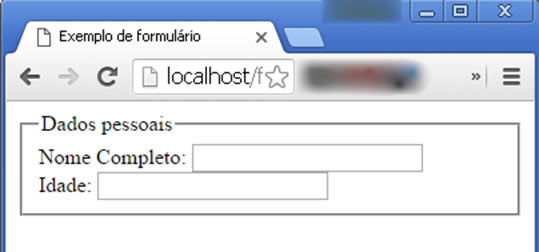

#### Tag `<datalist>`
* Combina `<input type="text">` com `<select>`, ou seja, é uma caixa de seleção que permite digitação
* Assim como o `<select>` utiliza `<oprion>` para determinar as opções disponíveis
* Necessita de um `<input>` com o atributo *list*
* Não possui suporte em navegadores Safari e IE versão 9 e anteriores
```html
<!DOCTYPE html>
<html lang="pt-br">
  <head>
    <title>Exemplo de formulário</title>
    <meta charset="utf-8">
  </head>
  <body>
    <form id="formulario" method="POST">
	 <label for="navegador">Qual seu navegador preferido?</label>
      <input list="navegadores" name="navegador">
      <datalist id="navegadores">
        <option value="Google Chrome">Google Chrome</option>
        <option value="Mozilla Firefox">Mozilla Firefox</option>
        <option value="Internet Explorer">Internet Explorer</option>
        <option value="Opera">Opera</option>
        <option value="Apple Safari">Apple Safari</option>
      </datalist>
    </form>
  </body>
</html>
```
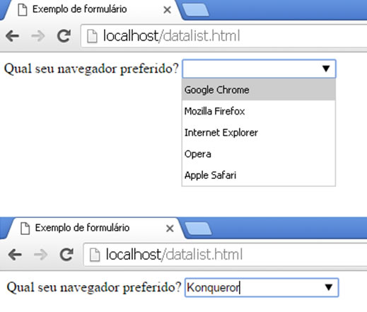

#### Tag `<progress>`
* Possibilita mostrar o prograsso de alguma ação, geralmente utilizado para mostrar o progresso de um upload
* Utiliza os atributos **value** (valor atual) e **max** (valor total)
* Nãõ possui suporte em navegadores IE versão 9 e anteriores
```html
<!DOCTYPE html>
<html lang="pt-br">
  <head>
    <title>Exemplo de formulário</title>
    <meta charset="utf-8">
  </head>
  <body>
    <form id="formulario" method="POST">
	 <progress value="25" max="100"></progress>
    </form>
  </body>
</html>
```
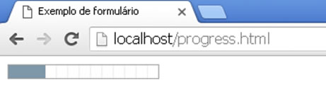

## CSS
---
### Intrudução
* O Cascading Style Sheets (CSS) é uma linguagem de estilos para trazer melhores recursos visuais a um documento HTML
* Foi criada pelo W3C para definir cores, tipologia, posicionamento e mais recursos emm páginas web
* Possibilita que determinadas propriedades sejam aplicadas, ao mesmo tempo, a diversos elementos de uma página ou site que estejam marcados com uma tag ou atributo específico, assim, facilitando a criação, formatação e manutenção de layouts e estilos de páginas web
* Existem três maneiras de aplicar, ou utilizar, um código CSS em um documento HTML:
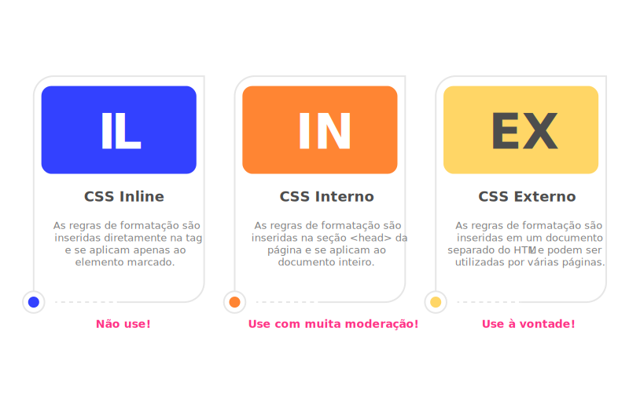
* No caso de aplicação de mais de uma maneira, existe uma hierarquia de qual será executada no caso de conflitos:
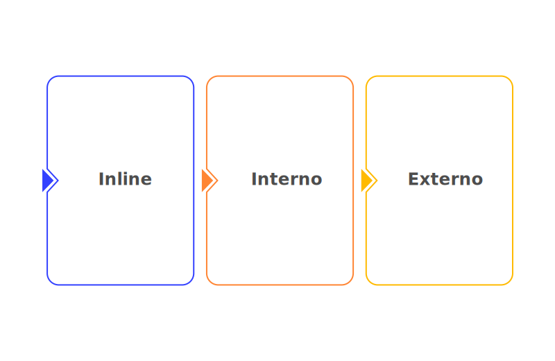

#### Declaraçao inline
* Declarada dentro da tag, misturada com seu conteúdo
* Dificulta a manutenção do código, caso você queira que a mesma regra seja usada por outro elemento, terá de refazer a mesma declaração no elemento desejado
* Utiliza o atributo **style**
```html
<p style="background-color: #900;">
  Luke, eu sou seu pai!
</p>
```

#### Declaração interna
* Declarada dentro da tag `<style>`, geralmente colocada dentro da tag `<head>`
* Com ela conseguimos reaproveitar todo o conteúdo de formatação no documento inteiro, porém, para reaproveitar entre diversos documentos, teríamos que copiar e colar em todos. Assim fica complicado realizar a manutenção e manter um padrão de layout e estilos em um sistema inteiro
```html
<style type="text/css">
  p{
    background-color: #900;
  }
</style>
```

#### Declaração externa
* Declaração em um arquivo externo contendo todo código CSS
* Uma mesma regra CSS dentro desse arquivo externo pode formatar simultaneamente quantas páginas o desenvolvedor precisar
* Necessita que os documentos html alvo façam vinculo com o documento CSS com a tag `<link>`, inserida na seção `<head>`
```html
<link rel="stylesheet" type="text/css" href="css/style.css">
```

#### Efeito Cascata
* O CSS recebe esse nome devido ao efeito cascata encontrado em sua aplicação no documento. Isso significa que, ao aplicar mais de um estilo em um elemento, poderá ocorrer uma sobreposição de estilos
* Sequência da cascata (do mais geral para o mais específico)
  * Estilo padrão do navegador
  * Folha de estilo externa (referenciada e/ou importada)
  * Folha de estilo interna (definida na área de cabeçalho do documento)
  * Folha de estilo inline (definida dentro de um elemento HTML)

#### Criando uma regra CSS
* A regra CSS é uma declaração com sintaxe própria que indica como será o estilo de um ou mais elementos HTML
* Um conjunto deregras forma o que chamamos de  folha de estilos
* A regra é composta por um seletor, propriedades e seus respectivos valores
```CSS
seletor {
  propriedade: valor;
}

h1 {
  color: red;
}
```
* Seletores podem ser elementos HTML como p, h1, h2 etc. Podem ser, também, identificadores que combinamos com o símbolo # e classes que combinamos com o símbolo ponto (.), ambos aplicados antes do nome

### Propriedades e Funcionamentos
* **font-family**
  * Define a fonte
* **Font-size**
  * Define o tamanho da fonte
* **Font-weight**
  * Define a intensidade do peso da fonte, ou seja, o quão negrito você vai deixar a fonte
* **margin**, **padding** e **border**
  * Definem as margens do bloco
  * Todo elemento HTML possui um formato de bloco, cada bloco possui três medidas em sua volta: padding, border e margin
    * Utilizamos cada uma dessas medidas para dar um respiro ao redor do elemento desejado
    * Fazem parte do que conhecemos como *box model*
    * Podemos atribuir as métricas da direção (top, bottom, left, right) de maneira individual ou de forma abreviada
```css
.seletor {
    /* 
          Escolha a medida para aplicar o espaçamento:
          - margin
          - padding
          - border
          No exemplo escolhemos a margin, mas o comando
          para as demais é o mesmo.
      */
    margin-top: 10px;
    margin-right: 15px;
    margin-bottom: 20px;
    margin-left: 25px;

    /*Formas abreviadas*/

    /*Todas as direções*/
    margin: 10px;

    /*vertical | horizontal*/
    margin: 20px 10px;

    /*top | right | bottom | left*/
    margint: 10px 15px 20px 25px;
  }
```
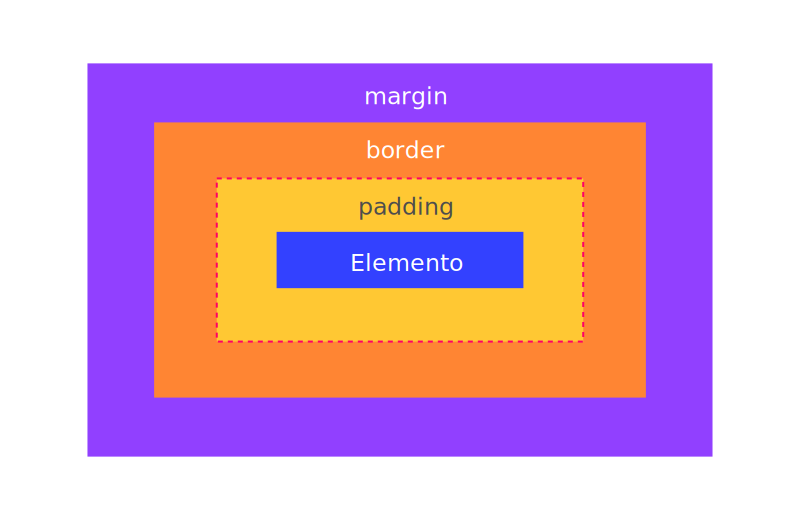
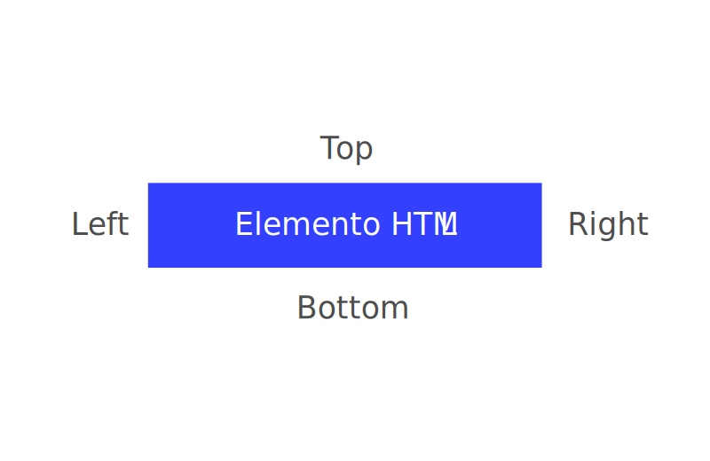

* **object-fit**
  * Define como o elemento responderá à altura e à largura do seu box
  * Valores
    * *fill*
      * Valor padrão, vai preencher o box com todo o conteúdo sem se preocupar com a distorção aplicada
    * *contain*
      * Expandirá ou reduzirá o tamanho da imagem para ocupar o tamanho do box, sepreocupando com a proporção correta do elemento
    * *cover*
      * Preencherá a altura e a largura do elemento, mantendo a sua proporção, porém realizará um corte na imagem para se encaixar de maneira adequada
    * *none*
      * Ignora as medidas e matém a imagem no tamanho original
    * *scale-down*
      * Compara a imagem entre o none e contain e mantém a de menor escala para o box
* **object-position**
  * Permite manipular a imagem dentro do box em x e y
  * `object-position: x% y%;`
* **border-radius**
  * Arredonda os cantos
* **box-shadow**
  * Aplica uma sombra ao elemento
  * Recebe os valores de deslocamento em x e y, sendo que valores positivos mantêm o sentido baixo à direita e negativos o oposto. O terceiro parâmetro é o espalhamento dessa sombra (*bluu*) e o quarto é a cor da sombra
  * `box-shadow: 1px 1px 15px #003300`
* **display**
  * 